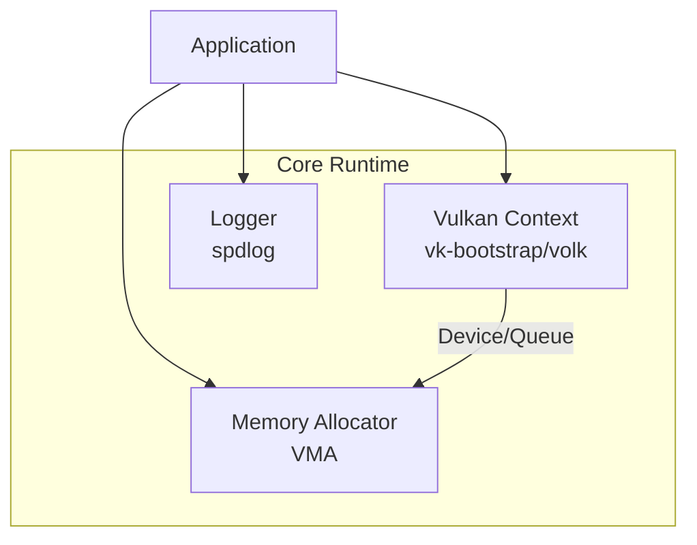

# Module 1: Core Infrastructure

## Overview
This module establishes the foundational Vulkan runtime environment, memory management, and logging systems using **Vulkan C++ bindings (vulkan.hpp)** exclusively for type safety and RAII resource management. All Vulkan objects use the `vk::` namespace.

**Key Technologies:**
- **Vulkan-HPP**: C++ bindings for type-safe Vulkan API
- **vk-bootstrap**: Simplified instance/device creation
- **volk**: Meta-loader for Vulkan function pointers
- **VMA**: Vulkan Memory Allocator
- **spdlog**: Fast C++ logging

## C4 Architecture

### Component Diagram


## Detailed Implementation Plan

### Phase 1: Logging System
**Goal**: Establish a thread-safe logging mechanism for debugging and error reporting.

1.  **Dependency Setup**:
    -   Ensure `spdlog` is linked via CMake (`find_package(spdlog CONFIG REQUIRED)`).
2.  **Class `Logger` Implementation**:
    -   **File**: `src/core/Logger.hpp` / `.cpp`
    -   **Step 1.1**: Define `static std::shared_ptr<spdlog::logger> s_logger`.
    -   **Step 1.2**: In `init()`:
        -   Create `std::vector<spdlog::sink_ptr> sinks`.
        -   Add `spdlog::sinks::stdout_color_sink_mt` (Console).
        -   Add `spdlog::sinks::basic_file_sink_mt` (File: `logs/engine.log`, truncate=true).
        -   Create logger: `s_logger = std::make_shared<spdlog::logger>("FluidEngine", sinks.begin(), sinks.end())`.
        -   Set pattern: `[%H:%M:%S.%e] [%^%l%$] [thread %t] %v`.
        -   Set level: `spdlog::level::trace` (configurable).
    -   **Step 1.3**: Define Macros in `.hpp` to avoid call overhead if disabled:
        ```cpp
        #define LOG_INFO(...) ::core::Logger::get()->info(__VA_ARGS__)
        #define LOG_WARN(...) ::core::Logger::get()->warn(__VA_ARGS__)
        #define LOG_ERROR(...) ::core::Logger::get()->error(__VA_ARGS__)
        #define LOG_CHECK(condition, msg) if(!(condition)) { LOG_ERROR(msg); throw std::runtime_error(msg); }
        ```

### Phase 2: Vulkan Context
**Goal**: Initialize Vulkan 1.3 with Compute capabilities and specific extensions.

1.  **Dependency Setup**:
    -   Link `vk-bootstrap` and `volk`.
    -   Include `<vulkan/vulkan.hpp>` (C++ bindings)
    -   Define `VULKAN_HPP_NO_STRUCT_CONSTRUCTORS` to control constructor generation
    -   Define `VK_NO_PROTOTYPES` globally (volk loads functions)
2.  **Error Handling**:
    -   C++ bindings throw exceptions by default, wrap in try-catch:
        ```cpp
        // Vulkan-HPP uses exceptions by default
        #define VK_CHECK_HPP(expr, msg) \
            try { \
                expr; \
            } catch (const vk::SystemError& e) { \
                LOG_ERROR("Vulkan Error ({}): {}", msg, e.what()); \
                throw; \
            }

        // Alternative: use vk::Result return values with VULKAN_HPP_NO_EXCEPTIONS
        ```
3.  **Class `VulkanContext` Implementation**:
    -   **File**: `src/core/VulkanContext.hpp` / `.cpp`
    -   **Step 2.1: Initialization**:
        -   Call `volkInitialize()`. Throw if returns anything other than `VK_SUCCESS`.
        -   Initialize Vulkan-HPP dispatcher:
            ```cpp
            VULKAN_HPP_DEFAULT_DISPATCHER.init(vkGetInstanceProcAddr);
            ```
    -   **Step 2.2: Instance**:
        -   Use `vkb::InstanceBuilder` (vk-bootstrap still uses C API internally).
        -   `.set_app_name("FluidEngine")`
        -   `.require_api_version(1, 3, 0)`
        -   `.request_validation_layers(enableValidation)`
        -   `.use_default_debug_messenger()`
        -   Build and store `vkb::Instance`.
        -   Call `volkLoadInstance(instance.instance)`.
        -   Wrap in C++ type: `m_instance = vk::Instance(instance.instance)`.
        -   Initialize instance-level dispatcher:
            ```cpp
            VULKAN_HPP_DEFAULT_DISPATCHER.init(m_instance);
            ```
    -   **Step 2.3: Physical Device**:
        -   Use `vkb::PhysicalDeviceSelector`.
        -   `.prefer_gpu_device_type(vkb::PreferredDeviceType::discrete)`
        -   **Required Features** (using C++ feature structures):
            -   `vk::PhysicalDeviceVulkan12Features`:
                - `.bufferDeviceAddress = true`
                - `.timelineSemaphore = true`
                - `.descriptorIndexing = true`
                - `.runtimeDescriptorArray = true`
                - `.shaderStorageBufferArrayNonUniformIndexing = true`
            -   `vk::PhysicalDeviceVulkan13Features`:
                - `.synchronization2 = true`
        -   Build and store `vkb::PhysicalDevice`.
        -   Wrap in C++ type: `m_physicalDevice = vk::PhysicalDevice(physDev.physical_device)`.
    -   **Step 2.4: Logical Device**:
        -   Use `vkb::DeviceBuilder`.
        -   Build and store `vkb::Device`.
        -   Call `volkLoadDevice(device.device)`.
        -   Wrap in C++ type: `m_device = vk::Device(device.device)`.
        -   Initialize device-level dispatcher:
            ```cpp
            VULKAN_HPP_DEFAULT_DISPATCHER.init(m_device);
            ```
    -   **Step 2.5: Queues**:
        -   Get Compute Queue: `VkQueue rawQueue = device.get_queue(vkb::QueueType::compute).value()`.
        -   Wrap: `m_computeQueue = vk::Queue(rawQueue)`.
        -   Get Transfer Queue similarly.
        -   Store Queue Family indices.

### Phase 3: Memory Management
**Goal**: Efficient GPU memory allocation using VMA.

1.  **Dependency Setup**:
    -   Link `VulkanMemoryAllocator`.
    -   Implementation file (`VmaUsage.cpp`): `#define VMA_IMPLEMENTATION` before include.
2.  **Class `MemoryAllocator` Implementation**:
    -   **File**: `src/core/MemoryAllocator.hpp` / `.cpp`
    -   **Step 3.1: Initialization**:
        -   Fill `VmaAllocatorCreateInfo` (VMA uses C API).
        -   `.flags = VMA_ALLOCATOR_CREATE_BUFFER_DEVICE_ADDRESS_BIT`.
        -   `.vulkanApiVersion = VK_API_VERSION_1_3`.
        -   Convert C++ handles to C: `VkInstance(context.getInstance())`, etc.
        -   `.instance = static_cast<VkInstance>(context.getInstance())`
        -   `.physicalDevice = static_cast<VkPhysicalDevice>(context.getPhysicalDevice())`
        -   `.device = static_cast<VkDevice>(context.getDevice())`
        -   Call `vmaCreateAllocator(&createInfo, &m_allocator)`.
    -   **Step 3.2: Buffer Creation**:
        -   Function: `createBuffer(size, usage, memoryUsage)` returns C++ `Buffer` struct.
        -   Create `vk::BufferCreateInfo` using C++ API:
            ```cpp
            vk::BufferCreateInfo bufferInfo{
                .size = size,
                .usage = usage,
                .sharingMode = vk::SharingMode::eExclusive
            };
            ```
        -   Convert to VkBufferCreateInfo for VMA: `VkBufferCreateInfo vkInfo = bufferInfo;`
        -   `VmaAllocationCreateInfo`: `.usage = VMA_MEMORY_USAGE_AUTO`.
        -   If `usage` includes `vk::BufferUsageFlagBits::eShaderDeviceAddress`, ensure proper flags.
        -   Call `vmaCreateBuffer()` and wrap result in `vk::Buffer`.
    -   **Step 3.3: Staging Buffer**:
        -   Usage: `VK_BUFFER_USAGE_TRANSFER_SRC_BIT`.
        -   VMA Usage: `VMA_MEMORY_USAGE_AUTO`, Flags: `VMA_ALLOCATION_CREATE_HOST_ACCESS_SEQUENTIAL_WRITE_BIT | VMA_ALLOCATION_CREATE_MAPPED_BIT`.
        -   Return mapped pointer in `Buffer` struct.
    -   **Step 3.4: Data Upload & Flushing**:
        -   `uploadToGPU(dst, src, size, offset)`:
            -   Create staging buffer.
            -   `memcpy(staging.mappedData, src, size)`.
            -   **Flush**: `vmaFlushAllocation(m_allocator, staging.allocation, 0, size)`.
            -   Execute `vkCmdCopyBuffer` via `VulkanContext::beginSingleTimeCommands`.

## Exposed Interfaces

### Class: `VulkanContext`
```cpp
class VulkanContext {
public:
    void init(bool enableValidation = true);
    void cleanup();

    // Getters using C++ types
    vk::Device getDevice() const { return m_device; }
    vk::PhysicalDevice getPhysicalDevice() const { return m_physicalDevice; }
    vk::Instance getInstance() const { return m_instance; }

    struct Queues {
        vk::Queue compute;
        uint32_t computeFamily;
        vk::Queue transfer;
        uint32_t transferFamily;
    };
    const Queues& getQueues() const;

    // Command pool creation using C++ API
    vk::CommandPool createCommandPool(uint32_t queueFamily,
                                      vk::CommandPoolCreateFlags flags = {});

    // Helper to create a one-time submit command buffer
    vk::CommandBuffer beginSingleTimeCommands(vk::CommandPool pool);
    void endSingleTimeCommands(vk::CommandBuffer cmd, vk::CommandPool pool, vk::Queue queue);

private:
    vk::Instance m_instance;
    vk::PhysicalDevice m_physicalDevice;
    vk::Device m_device;
    Queues m_queues;

    // Keep vk-bootstrap objects for cleanup
    vkb::Instance m_vkbInstance;
    vkb::Device m_vkbDevice;
};
```

### Class: `MemoryAllocator`
```cpp
class MemoryAllocator {
public:
    struct Buffer {
        vk::Buffer handle;                      // C++ buffer handle
        VmaAllocation allocation = nullptr;     // VMA allocation (C API)
        vk::DeviceAddress deviceAddress = {};   // For bindless access
        vk::DeviceSize size = 0;
        void* mappedData = nullptr;             // Non-null if persistently mapped
    };

    explicit MemoryAllocator(const VulkanContext& context);
    ~MemoryAllocator();

    // Create buffer using C++ usage flags
    Buffer createBuffer(vk::DeviceSize size,
                       vk::BufferUsageFlags usage,
                       VmaMemoryUsage memoryUsage = VMA_MEMORY_USAGE_AUTO);

    void destroyBuffer(Buffer& buffer);

    // Copies data from CPU to GPU using a staging buffer and immediate submit
    void uploadToGPU(const Buffer& dst, const void* srcData,
                    vk::DeviceSize size, vk::DeviceSize offset = 0);

    // Get buffer device address (for bindless)
    vk::DeviceAddress getBufferAddress(const Buffer& buffer);

private:
    VmaAllocator m_allocator;
    const VulkanContext& m_context;
};
```
