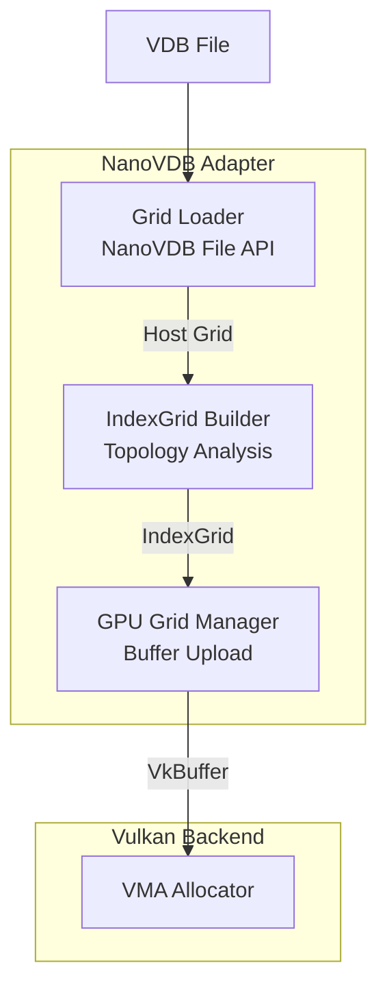

# Module 2: NanoVDB Integration

## Overview
This module handles the loading and management of NanoVDB grids. It bridges the gap between disk-based VDB files and GPU-resident `IndexGrid` structures required for efficient traversal.

**Key Concepts:**
- **NanoVDB**: GPU-optimized sparse voxel data structure
- **IndexGrid**: Maps 3D coordinates to linear indices for SoA access
- **Morton Ordering**: Z-order curve for spatial locality
- **Active Voxel Count**: Only stores sparse, occupied voxels

**Integration with Vulkan C++:**
All GPU buffers use `vk::Buffer` from vulkan.hpp, and buffer operations use the C++ API.

## C4 Architecture

### Component Diagram


## Detailed Implementation Plan

### Phase 1: Grid Loading
**Goal**: Load `.nvdb` files into host memory and validate structure.

1.  **Dependency Setup**:
    -   Link `NanoVDB` (Header-only or library).
2.  **Class `GridLoader` Implementation**:
    -   **File**: `src/nanovdb_adapter/GridLoader.hpp` / `.cpp`
    -   **Step 1.1**: `loadGrid(path, gridName)`
        -   Call `nanovdb::io::readGrid(path.string(), gridName)`.
        -   If `gridName` is empty, read the first grid: `nanovdb::io::readGrid(path.string())`.
    -   **Step 1.2**: Validation
        -   Check `handle.getGrid() != nullptr`.
        -   Check `grid->gridType()`. Supported types: `nanovdb::GridType::Float` (Density/Temp), `nanovdb::GridType::Vec3f` (Velocity).
        -   Throw `std::runtime_error` on mismatch.
    -   **Step 1.3**: Return `nanovdb::GridHandle<nanovdb::HostBuffer>`.

### Phase 2: IndexGrid & LUT Generation
**Goal**: Convert sparse tree to linear GPU structures for `O(1)` access.

1.  **Algorithm**:
    -   **File**: `src/nanovdb_adapter/IndexGridBuilder.cpp`
    -   **Step 2.1**: Accessor Setup
        -   Get `nanovdb::Grid` pointer from handle.
        -   Get `tree` accessor.
    -   **Step 2.2**: Leaf Collection
        -   Iterate all active values: `for(auto it = tree.beginValueOn(); it; ++it)`.
        -   Get Coordinate: `nanovdb::Coord ijk = it.getCoord()`.
        -   Store in `std::vector<nanovdb::Coord> activeCoords`.
    -   **Step 2.3**: LUT Generation (Morton Sort)
        -   **Morton Code**:
            ```cpp
            // Simple bit-interleaving for 3D coordinates
            uint64_t morton3D(uint32_t x, uint32_t y, uint32_t z) {
                x = (x | (x << 16)) & 0x030000FF;
                x = (x | (x <<  8)) & 0x0300F00F;
                x = (x | (x <<  4)) & 0x030C30C3;
                x = (x | (x <<  2)) & 0x09249249;
                // ... repeat for y and z with shifts ...
                return x | (y << 1) | (z << 2);
            }
            ```
        -   **Sort**:
            ```cpp
            std::sort(activeCoords.begin(), activeCoords.end(), 
                [](const auto& a, const auto& b) {
                    return morton3D(a[0], a[1], a[2]) < morton3D(b[0], b[1], b[2]);
                });
            ```
    -   **Step 2.4**: Linear Buffer Construction
        -   Create `std::vector<float> values`.
        -   Fill with values from `activeCoords` (now sorted).

### Phase 3: GPU Grid Manager
**Goal**: Upload data to GPU and provide shader accessors.

1.  **Class `GpuGridManager` Implementation**:
    -   **File**: `src/nanovdb_adapter/GpuGridManager.hpp` / `.cpp`
    -   **Step 3.1**: `uploadGrid(hostHandle)`
        -   Calculate size: `hostHandle.size()` (bytes).
        -   Allocate `gridBuffer` using `MemoryAllocator::createBuffer()`:
            ```cpp
            auto gridBuffer = allocator.createBuffer(
                hostHandle.size(),
                vk::BufferUsageFlagBits::eStorageBuffer |
                vk::BufferUsageFlagBits::eTransferDst |
                vk::BufferUsageFlagBits::eShaderDeviceAddress
            );
            ```
        -   Use `MemoryAllocator::uploadToGPU()` to copy raw NanoVDB buffer.
    -   **Step 3.2**: Upload Index Structures
        -   **Index Buffer** (linear voxel indices):
            ```cpp
            auto indexBuffer = allocator.createBuffer(
                activeCount * sizeof(uint32_t),
                vk::BufferUsageFlagBits::eStorageBuffer |
                vk::BufferUsageFlagBits::eTransferDst |
                vk::BufferUsageFlagBits::eShaderDeviceAddress
            );
            ```
        -   **LUT Buffer** (coordinate lookup table):
            ```cpp
            auto lutBuffer = allocator.createBuffer(
                activeCount * sizeof(nanovdb::Coord), // 3x int32
                vk::BufferUsageFlagBits::eStorageBuffer |
                vk::BufferUsageFlagBits::eTransferDst
            );
            ```
        -   Upload sorted coords to `lutBuffer`.
        -   Upload values to `indexBuffer`.
    -   **Step 3.3**: Create `PNanoVDB` struct
        -   **Alignment**: Ensure 8-byte alignment for `uint64_t` addresses (C++ guarantees this).
        -   Get device addresses using C++ API:
            ```cpp
            PNanoVDB gpuStruct{
                .rawGridAddress = static_cast<uint64_t>(allocator.getBufferAddress(gridBuffer)),
                .lutCoordsAddress = static_cast<uint64_t>(allocator.getBufferAddress(lutBuffer)),
                .linearValuesAddress = static_cast<uint64_t>(allocator.getBufferAddress(indexBuffer)),
                .activeVoxelCount = activeCount
            };
            ```

## Exposed Interfaces

### Class: `GridLoader`
```cpp
class GridLoader {
public:
    static nanovdb::GridHandle<nanovdb::HostBuffer> load(const std::filesystem::path& path);
};
```

### Class: `GpuGridManager`
```cpp
class GpuGridManager {
public:
    struct GridResources {
        MemoryAllocator::Buffer rawGrid;         // Full NanoVDB grid structure
        MemoryAllocator::Buffer lutCoords;       // Sorted Coords for reverse lookup
        MemoryAllocator::Buffer linearValues;    // Values in Morton order
        uint32_t activeVoxelCount;
        nanovdb::CoordBBox bounds;               // World-space bounds

        // Helper to get shader struct (device addresses)
        PNanoVDB getShaderStruct() const {
            return PNanoVDB{
                .rawGridAddress = static_cast<uint64_t>(rawGrid.deviceAddress),
                .lutCoordsAddress = static_cast<uint64_t>(lutCoords.deviceAddress),
                .linearValuesAddress = static_cast<uint64_t>(linearValues.deviceAddress),
                .activeVoxelCount = activeVoxelCount
            };
        }
    };

    explicit GpuGridManager(MemoryAllocator& allocator);

    // Upload grid from host to GPU
    GridResources upload(const nanovdb::GridHandle<nanovdb::HostBuffer>& grid);

    // Cleanup resources
    void destroyGrid(GridResources& resources);

private:
    MemoryAllocator& m_allocator;
};
```

### Shader Interop
```cpp
// Matches GLSL std430 layout
struct PNanoVDB {
    uint64_t rawGridAddress;
    uint64_t lutCoordsAddress;
    uint64_t linearValuesAddress;
    uint32_t activeVoxelCount;
    uint32_t _pad; // Align to 8 bytes if needed, though u64 is 8-byte aligned
};
```
