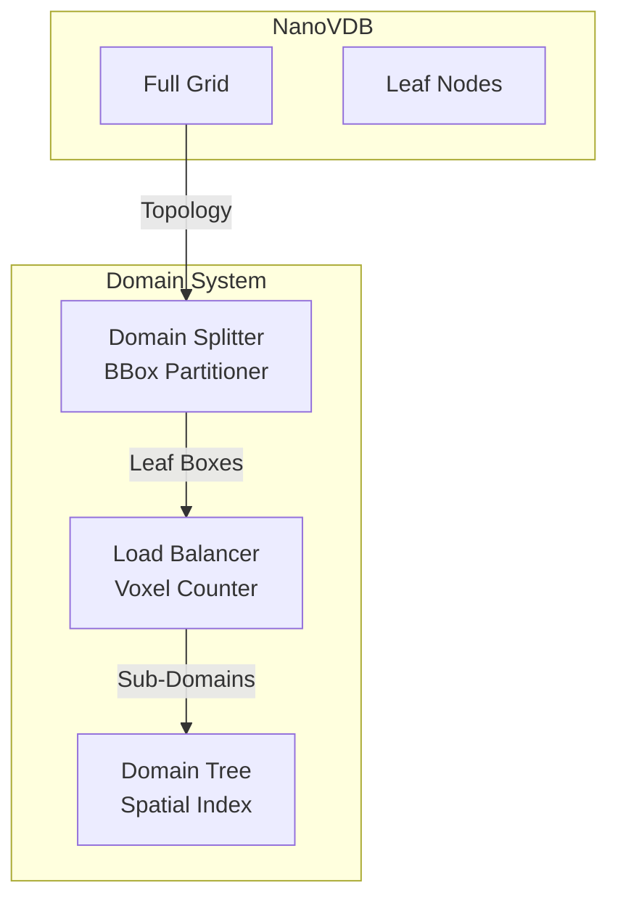

# Module 4: Domain Decomposition

## Overview
This module handles splitting the global simulation domain into sub-domains for multi-GPU execution. It ensures that partitions align with NanoVDB leaf nodes to minimize overhead.

**Key Algorithms:**
- **Morton Code Sorting**: Z-order curve for spatial coherence
- **Load Balancing**: Even distribution of active voxels across GPUs
- **Leaf-Aligned Splits**: Never split within an 8³ leaf node
- **Sub-Grid Extraction**: Create independent NanoVDB grids per GPU

**Note:** This module primarily uses NanoVDB CPU API; Vulkan C++ types used when interfacing with GPU resources.

## C4 Architecture

### Component Diagram


## Detailed Implementation Plan

### Phase 1: Leaf Node Analysis
**Goal**: Extract active leaf nodes to determine work distribution.

1.  **Class `DomainSplitter` Implementation**:
    -   **File**: `src/domain/DomainSplitter.hpp` / `.cpp`
    -   **Step 1.1**: `analyzeGrid(grid)`
        -   Access `grid->tree()`.
        -   Iterate leaf nodes: `for (auto it = tree.beginLeaf(); it; ++it)`.
        -   Get BBox: `it->bbox()`. Note: NanoVDB BBox is in index space (Coord).
        -   Store in `std::vector<nanovdb::CoordBBox> leaves`.

### Phase 2: Partitioning Algorithm (Morton Split)
**Goal**: Spatially coherent splitting.

1.  **Algorithm**:
    -   **Step 2.1**: Morton Code Calculation
        ```cpp
        // 3D Morton code (Z-order curve)
        uint64_t getMortonCode(const nanovdb::Coord& c) {
            // Use PDEP if AVX2 is available, otherwise bit-interleaving
            // See Module 2 for bit-interleaving implementation
            return morton3D(c[0], c[1], c[2]);
        }
        ```
    -   **Step 2.2**: Sort
        -   `std::sort(leaves.begin(), leaves.end(), [](a, b) { return getMortonCode(a.min()) < getMortonCode(b.min()); })`.
    -   **Step 2.3**: Split (Load Balancing)
        -   Calculate Total Active Voxels `V_total` (sum of `leaf.voxelCount()`).
        -   Target per GPU `V_target = V_total / gpuCount`.
        -   Iterate through sorted leaves, accumulating voxel count.
        -   When `current_count >= V_target`, close current partition and start next.
        -   **Constraint**: Ensure partitions don't split single leaf nodes (NanoVDB requirement).
        -   Create `SubDomain`:
            -   `gpuIndex = i`.
            -   `leaves = {leaves[start] ... leaves[end-1]}`.
            -   `bounds = Union(all leaves in range)`.

### Phase 3: Sub-Domain Extraction
**Goal**: Create a valid NanoVDB grid for each GPU.

1.  **Logic**:
    -   **Step 3.1**: `extractSubGrid(originalGrid, subDomain)`
    -   **Step 3.2**: Use `nanovdb::GridBuilder<float> builder(backgroundValue)`.
    -   **Step 3.3**: Iterate `subDomain.leaves`.
    -   **Step 3.4**: For each leaf, iterate its active voxels in `originalGrid`.
        -   `auto leaf = originalGrid.tree().findLeaf(leafBox.min())`.
        -   `for (auto it = leaf->beginValueOn(); it; ++it)`.
        -   `builder.setValue(it.getCoord(), *it)`.
    -   **Step 3.5**: `nanovdb::createNanoGrid(builder)`.

## Exposed Interfaces

### Struct: `SubDomain`
```cpp
struct SubDomain {
    uint32_t gpuIndex;
    nanovdb::CoordBBox bounds;                            // Inclusive bounding box
    uint32_t activeVoxelCount;
    std::vector<nanovdb::CoordBBox> assignedLeaves;      // Leaf nodes in this domain

    // Neighbor information for halo exchange
    struct Neighbor {
        uint32_t gpuIndex;
        uint32_t face; // 0=-X, 1=+X, 2=-Y, 3=+Y, 4=-Z, 5=+Z
    };
    std::vector<Neighbor> neighbors;                      // Adjacent sub-domains

    // Statistics
    uint64_t estimatedMemoryUsage() const {
        return activeVoxelCount * sizeof(float) * 8; // Estimate for typical field count
    }
};
```

### Class: `DomainSplitter`
```cpp
class DomainSplitter {
public:
    // Configuration for splitting strategy
    struct SplitConfig {
        uint32_t gpuCount = 1;
        uint32_t haloThickness = 2;              // Voxels to overlap for stencils
        bool preferSpatialLocality = true;       // Use Morton ordering
        float loadBalanceTolerance = 0.1f;       // 10% imbalance allowed
    };

    explicit DomainSplitter(const SplitConfig& config = {});

    // Helper to calculate Morton code (Z-order curve)
    static uint64_t getMortonCode(const nanovdb::Coord& coord);

    // Main split function - divides grid into sub-domains
    std::vector<SubDomain> split(const nanovdb::GridHandle<nanovdb::HostBuffer>& grid);

    // Extract sub-grid for a specific domain
    nanovdb::GridHandle<nanovdb::HostBuffer> extract(
        const nanovdb::GridHandle<nanovdb::HostBuffer>& fullGrid,
        const SubDomain& domain);

    // Analyze load balance quality
    struct LoadBalanceStats {
        uint32_t minVoxels, maxVoxels;
        double averageVoxels, standardDeviation;
        double imbalanceFactor; // max / avg
    };
    LoadBalanceStats analyzeBalance(const std::vector<SubDomain>& domains) const;

private:
    SplitConfig m_config;

    // Find neighbors for halo exchange
    void computeNeighbors(std::vector<SubDomain>& domains);
};
```
