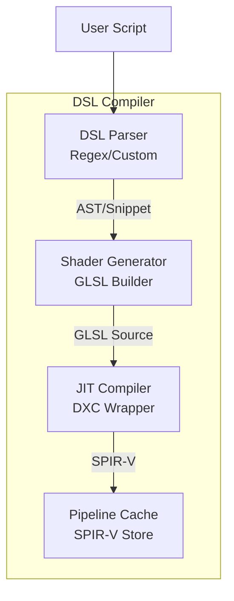

# Module 6: Stencil DSL & Compiler

## Overview
This module implements the Domain-Specific Language (DSL) for defining fluid stencils and the Just-In-Time (JIT) compiler that converts them into SPIR-V compute shaders.

**Key Features:**
- **Runtime Compilation**: No engine recompilation needed for new stencils
- **Type Safety**: Field names validated against FieldRegistry
- **Code Generation**: Automatic GLSL wrapper generation
- **SPIR-V Output**: Via DirectXShaderCompiler (DXC)
- **Pipeline Caching**: Compiled shaders cached to disk

**Vulkan C++ Integration:**
Pipelines created using `vk::ComputePipelineCreateInfo` and C++ RAII handles.

## C4 Architecture

### Component Diagram


## Detailed Implementation Plan

### Phase 1: DSL Parser
**Goal**: Parse Lua table into C++ struct.

1.  **Class `StencilParser`**:
    -   **File**: `src/stencil/StencilParser.hpp`
    -   **Step 1.1**: Input is `sol::table`.
    -   **Step 1.2**: Validation
        -   Check keys: `inputs` (table of strings), `outputs` (table of strings), `code` (string).
        -   Verify field names exist in `FieldRegistry`.
    -   **Step 1.3**: Struct Population
        -   `def.inputs = table["inputs"]`.
        -   `def.code = table["code"]`.
        -   `def.neighborRadius = table.get_or("neighbor_radius", 0)`.

### Phase 2: Shader Generator
**Goal**: Construct valid GLSL 4.6 Compute Shader.

1.  **Class `ShaderGenerator`**:
    -   **File**: `src/stencil/ShaderGenerator.cpp`
    -   **Step 2.1**: Header (Boilerplate)
        ```glsl
        #version 460
        #extension GL_EXT_buffer_reference : require
        #extension GL_EXT_scalar_block_layout : require
        #extension GL_EXT_buffer_reference2 : require
        #extension GL_EXT_shader_explicit_arithmetic_types_int64 : require
        
        layout(local_size_x = 128) in;
        ```
    -   **Step 2.2**: Buffer References
        -   Iterate `FieldRegistry`. For each field `F`:
            `layout(buffer_reference, scalar) buffer F_Buf { float data[]; };`
    -   **Step 2.3**: Push Constants
        ```glsl
        layout(push_constant) uniform PC {
            uint64_t bdaTable;
            uint64_t gridAddr;
            uint32_t count;
            // ... other params
        };
        ```
    -   **Step 2.4**: Main Function
        -   `uint idx = gl_GlobalInvocationID.x; if(idx >= count) return;`
        -   Inject User Code. Replace `Read(name)` with `F_Buf(bda[idx]).data[idx]`.

### Phase 3: JIT Compilation (DXC)
**Goal**: Compile GLSL string to SPIR-V.

1.  **Class `DXCCompiler`**:
    -   **File**: `src/stencil/DXCCompiler.cpp`
    -   **Step 3.1**: Init
        -   `DxcCreateInstance(CLSID_DxcUtils, ...)`
        -   `DxcCreateInstance(CLSID_DxcCompiler, ...)`
    -   **Step 3.2**: Compile
        -   Create `DxcBuffer`.
        -   **Arguments**:
            ```cpp
            std::vector<LPCWSTR> args = {
                L"-E", L"main",
                L"-T", L"cs_6_6",
                L"-spirv",
                L"-fspv-target-env=vulkan1.3",
                L"-fvk-use-dx-layout" // Critical for buffer_reference
            };
            ```
        -   `compiler->Compile(...)`.
    -   **Step 3.3**: Error Handling
        -   Check `result->GetStatus()`.
        -   If failed, get error blob, convert to string, log error, throw.
    -   **Step 3.4**: Output
        -   Get result blob. Copy to `std::vector<uint32_t>`.

## Exposed Interfaces

### Struct: `StencilDefinition`
```cpp
struct StencilDefinition {
    std::string name;
    std::vector<std::string> inputs;
    std::vector<std::string> outputs;
    std::string code;
    uint32_t neighborRadius;
};
```

### Class: `StencilCompiler`
```cpp
class StencilCompiler {
public:
    StencilCompiler(const FieldRegistry& registry);
    
    // Returns compiled pipeline and layout
    struct Result {
        VkPipeline pipeline;
        VkPipelineLayout layout;
    };
    
    Result compile(const StencilDefinition& def, VkDevice device, VkPipelineCache cache);
};
```
