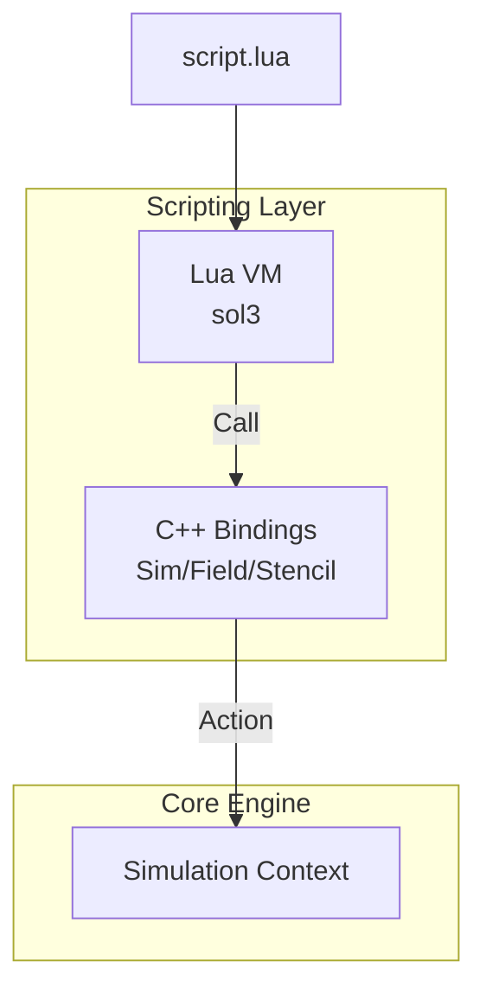

# Module 8: Runtime Scripting

## Overview
This module provides the user-facing API via Lua. It allows users to define fields, stencils, and simulation parameters without recompiling the engine.

## C4 Architecture

### Component Diagram


## Detailed Implementation Plan

### Phase 1: Lua Initialization
**Goal**: Setup Lua state.

1.  **Class `LuaContext`**:
    -   **File**: `src/script/LuaContext.hpp`
    -   **Step 1.1**: Member `sol::state lua`.
    -   **Step 1.2**: Constructor
        -   `lua.open_libraries(sol::lib::base, sol::lib::math, sol::lib::package)`.

### Phase 2: Bindings
**Goal**: Expose C++ to Lua.

1.  **Method `bindEngine(FluidEngine& engine)`**:
    -   **Step 2.1**: `lua.new_usertype<FluidEngine>("FluidEngine")`.
    -   **Step 2.2**: Bind `add_field`.
        -   `"add_field", &FluidEngine::addField`.
        -   Handle enums: `lua["Format"]["R32F"] = VK_FORMAT_R32_SFLOAT`.
    -   **Step 2.3**: Bind `add_stencil` (Table Parsing).
        ```cpp
        "add_stencil", [](FluidEngine& self, std::string name, sol::table def) {
            StencilDefinition d;
            d.name = name;
            d.code = def["code"];
            
            sol::table inputs = def["inputs"];
            for(auto& kv : inputs) d.inputs.push_back(kv.second.as<string>());
            
            sol::table outputs = def["outputs"];
            for(auto& kv : outputs) d.outputs.push_back(kv.second.as<string>());
            
            self.addStencil(d);
        }
        ```
    -   **Step 2.4**: Bind `run`.
        -   `"run", &FluidEngine::run`.

### Phase 3: Error Handling
**Goal**: Safe execution.

1.  **Logic**:
    -   **Step 3.1**: `runScript(path)`
    -   **Step 3.2**: Protected Call
        ```cpp
        sol::protected_function_result result = lua.script_file(path);
        if (!result.valid()) {
            sol::error err = result;
            LOG_ERROR("Lua Script Error: {}", err.what());
            throw std::runtime_error(err.what());
        }
        ```

## Exposed Interfaces

### Class: `LuaContext`
```cpp
class LuaContext {
public:
    LuaContext();
    void bindEngine(FluidEngine& engine);
    void runScript(const std::filesystem::path& path);
};

### Lua API Examples
```lua
-- Example 1: Basic Setup
sim = FluidEngine.new({
    gpu_count = 2,
    domain_size = {256, 256, 256},
    grid_file = "data/smoke.nvdb"
})

-- Add fields
sim:add_field("density", Format.R32F, 0.0)
sim:add_field("velocity", Format.R32G32B32F, {0, 0, 0})
sim:add_field("temperature", Format.R32F, 300.0)

-- Define stencil
sim:add_stencil("advect", {
    inputs = {"density", "velocity"},
    outputs = {"density_new"},
    code = [[
        vec3 vel = ReadField("velocity", idx);
        ivec3 backPos = coord - ivec3(vel * dt);
        float d = ReadField("density", backPos);
        WriteField("density_new", idx, d);
    ]],
    requires_halos = true
})

-- Run simulation
for frame = 1, 100 do
    sim:step(dt = 0.016)
    if frame % 10 == 0 then
        sim:export_vdb("output/frame_" .. frame .. ".vdb")
    end
end
```
