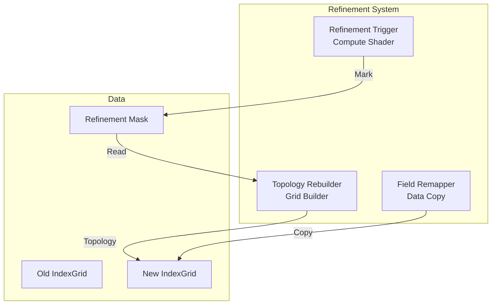

# Module 9: Dynamic Refinement

## Overview
This module handles the adaptive nature of the simulation. It detects regions needing higher resolution (e.g., high vorticity) and rebuilds the NanoVDB grid topology on the fly.

## C4 Architecture

### Component Diagram


## Detailed Implementation Plan

### Phase 1: Refinement Trigger
**Goal**: Identify voxels that need splitting or merging.

1.  **Shader**: `shaders/mark_refinement.comp`
    -   **Step 1.1**: Inputs
        -   `FieldBuf velocity`
        -   `uint8_t[] mask` (Size = activeVoxelCount)
    -   **Step 1.2**: Logic
        -   Calculate Curl: `cross(d(vel)/dx, d(vel)/dy, ...)`
        -   Magnitude `m = length(curl)`
        -   If `m > high_thresh`: `mask[idx] = 1` (Refine)
        -   Else if `m < low_thresh`: `mask[idx] = 2` (Coarsen)
        -   Else: `mask[idx] = 0` (Keep)

### Phase 2: Topology Rebuilding
**Goal**: Construct new NanoVDB grid.

1.  **Class `TopologyRebuilder`**:
    -   **File**: `src/refinement/TopologyRebuilder.cpp`
    -   **Step 2.1**: Download Mask
        -   Copy `maskBuffer` to Host.
    -   **Step 2.2**: Build New Grid
        ```cpp
        nanovdb::GridBuilder<float> builder(0.0f);
        for (size_t i = 0; i < activeCount; ++i) {
            auto coord = oldLUT[i];
            uint8_t action = mask[i];
            
            if (action == 1) { // Refine
                // Add 8 children at finer level (conceptually)
                // Note: NanoVDB GridBuilder handles hierarchy. 
                // We just set values at finer coordinates.
                // This requires GridBuilder to support explicit level setting or 
                // we assume base level is leaf.
            } else if (action == 2) { // Coarsen
                // If all siblings want to coarsen, add parent
            } else {
                builder.setValue(coord, oldValue);
            }
        }
        ```
    -   **Step 2.3**: Upload
        -   Call `GpuGridManager::uploadGrid`.

### Phase 3: Field Remapping
**Goal**: Transfer data to new grid layout.

1.  **Shader**: `shaders/remap_fields.comp`
    -   **Step 3.1**: Inputs
        -   `OldField`, `NewField`
        -   `OldGrid`, `NewGrid`
    -   **Step 3.2**: Logic (Run on New Grid Voxels)
        ```glsl
        uint newIdx = gl_GlobalInvocationID.x;
        ivec3 newCoord = NewLUT[newIdx];
        vec3 worldPos = IndexToWorld(newCoord);
        
        // Trilinear Interpolation from Old Grid
        float oldVal = SampleTrilinear(OldField, OldGrid, worldPos);
        
        NewField[newIdx] = oldVal;
        ```

## Exposed Interfaces

### Class: `RefinementManager`
```cpp
class RefinementManager {
public:
    // Refinement criteria (user-customizable)
    struct Criteria {
        std::string triggerField = "vorticity";  // Field to monitor
        float refineThreshold = 0.5f;             // Split if value > this
        float coarsenThreshold = 0.1f;            // Merge if value < this
        uint32_t minRefinementLevel = 0;
        uint32_t maxRefinementLevel = 3;
    };

    RefinementManager(VulkanContext& ctx, MemoryAllocator& allocator, const Criteria& criteria = {});
    ~RefinementManager();

    // Mark cells for refinement (using C++ CommandBuffer)
    void markCells(vk::CommandBuffer cmd, const std::string& fieldName);

    // Returns true if topology changed and needs field remapping
    bool rebuildTopology(GpuGridManager& gridMgr);

    // Remap all fields to new grid (using C++ CommandBuffer)
    void remapFields(vk::CommandBuffer cmd,
                    const GpuGridManager::GridResources& oldGrid,
                    const GpuGridManager::GridResources& newGrid,
                    FieldRegistry& fields);

    // Get refinement statistics
    struct Stats {
        uint32_t cellsRefined = 0;
        uint32_t cellsCoarsened = 0;
        uint32_t totalActiveCells = 0;
    };
    Stats getLastRefinementStats() const { return m_lastStats; }

private:
    VulkanContext& m_context;
    MemoryAllocator& m_allocator;
    Criteria m_criteria;
    Stats m_lastStats;

    // Compute pipelines for refinement operations (using C++ types)
    vk::Pipeline m_markPipeline;
    vk::Pipeline m_remapPipeline;
    vk::PipelineLayout m_pipelineLayout;

    // Refinement mask buffer
    MemoryAllocator::Buffer m_maskBuffer;
};
```
