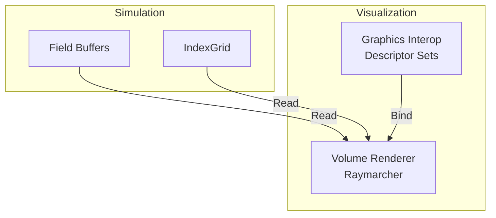

# Module 10: Visualization

## Overview
This module provides real-time visualization of the fluid simulation. It leverages the fact that data is already on the GPU to render without expensive CPU readbacks.

## C4 Architecture

### Component Diagram


## Detailed Implementation Plan

### Phase 1: Render Pipeline
**Goal**: Setup Vulkan Graphics Pipeline.

1.  **Class `VolumeRenderer`**:
    -   **File**: `src/vis/VolumeRenderer.cpp`
    -   **Step 1.1**: Render Pass
        -   Attachment: Swapchain Format.
        -   LoadOp: Clear (Black).
    -   **Step 1.2**: Descriptor Set Layout
        -   Binding 0: Uniform Buffer (Camera).
        -   Binding 1: Storage Buffer (PNanoVDB).
        -   Binding 2: Storage Buffer (Field Data).
    -   **Step 1.3**: Pipeline
        -   Vertex Shader: `quad.vert` (Generates full-screen triangle).
        -   Fragment Shader: `volume.frag`.
        -   Blending: `SrcAlpha`, `OneMinusSrcAlpha`.

### Phase 2: Raymarcher Shader
**Goal**: Render volumetric data.

1.  **Shader**: `shaders/volume.frag`
    -   **Step 2.1**: Ray Setup
        -   `ro = cameraPos`.
        -   `rd = normalize(pixelWorldPos - cameraPos)`.
    -   **Step 2.2**: AABB Intersection
        ```glsl
        vec2 intersectAABB(vec3 ro, vec3 rd, vec3 boxMin, vec3 boxMax) {
            vec3 tMin = (boxMin - ro) / rd;
            vec3 tMax = (boxMax - ro) / rd;
            vec3 t1 = min(tMin, tMax);
            vec3 t2 = max(tMin, tMax);
            float tNear = max(max(t1.x, t1.y), t1.z);
            float tFar = min(min(t2.x, t2.y), t2.z);
            return vec2(tNear, tFar);
        }
        ```
    -   **Step 2.3**: Marching Loop
        -   `t = tMin`.
        -   `while (t < tMax && alpha < 0.99)`:
            -   `pos = ro + rd * t`.
            -   `coord = WorldToIndex(pos)`.
            -   `val = Sample(Grid, Field, coord)`.
            -   `col += (1-alpha) * val * color * step`.
            -   `alpha += (1-alpha) * val * step`.
            -   `t += step`.

### Phase 3: Interop
**Goal**: Sync Compute and Graphics.

1.  **Logic**:
    -   **Step 3.1**: Before Render Pass
        ```cpp
        VkBufferMemoryBarrier barrier = {
            .srcAccessMask = VK_ACCESS_SHADER_WRITE_BIT,
            .dstAccessMask = VK_ACCESS_SHADER_READ_BIT,
            .srcQueueFamilyIndex = computeFamily,
            .dstQueueFamilyIndex = graphicsFamily
        };
        vkCmdPipelineBarrier(cmd, VK_PIPELINE_STAGE_COMPUTE_SHADER_BIT, 
                           VK_PIPELINE_STAGE_FRAGMENT_SHADER_BIT, ...);
        ```

## Exposed Interfaces

### Class: `VolumeRenderer`
```cpp
class VolumeRenderer {
public:
    struct Config {
        uint32_t width = 1920;
        uint32_t height = 1080;
        float stepSize = 0.5f;              // Ray marching step size
        float densityScale = 1.0f;          // Density multiplier for visualization
        glm::vec3 lightDir = {0, 1, 0};    // Directional light
    };

    VolumeRenderer(VulkanContext& ctx, vk::RenderPass renderPass, const Config& config = {});
    ~VolumeRenderer();

    // Update which field to visualize (using C++ types)
    void updateDescriptors(const FieldRegistry& registry, const GpuGridManager& gridMgr);

    // Render volume to framebuffer (using C++ CommandBuffer)
    void render(vk::CommandBuffer cmd, const Camera& camera);

    // Update visualization settings
    void setConfig(const Config& config);

private:
    VulkanContext& m_context;
    Config m_config;

    // Graphics pipeline resources (using C++ types)
    vk::Pipeline m_pipeline;
    vk::PipelineLayout m_layout;
    vk::DescriptorSet m_descriptorSet;
    vk::DescriptorSetLayout m_descriptorSetLayout;

    // Camera uniform buffer
    MemoryAllocator::Buffer m_cameraUBO;
};
```
