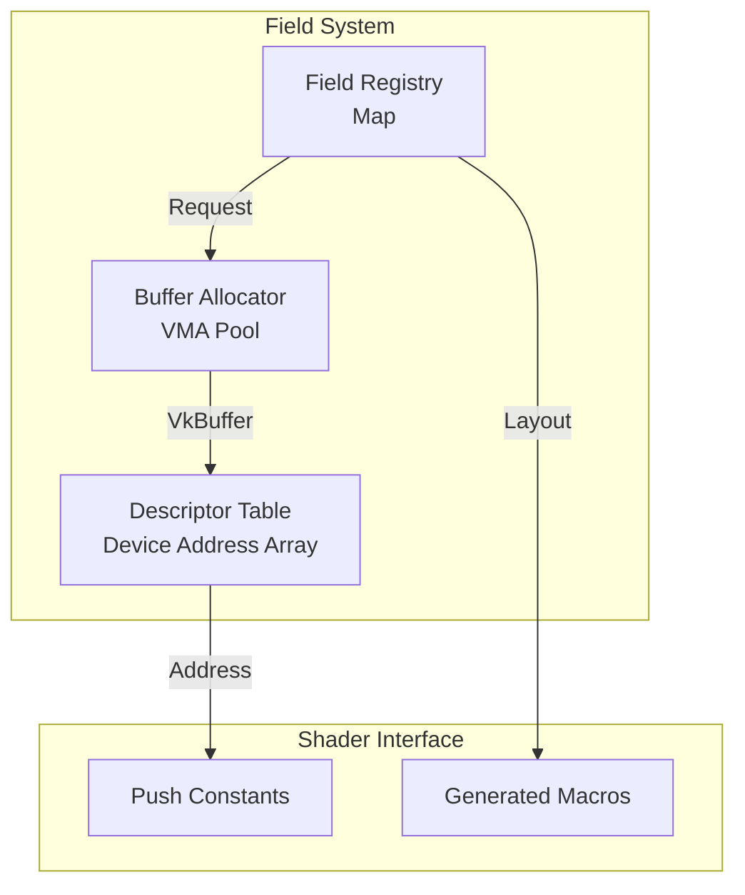

# Module 3: Field System

## Overview
This module implements the Structure of Arrays (SoA) memory layout and the dynamic field registry. It enables the bindless access model used by compute shaders.

**Key Features:**
- **Bindless Descriptors**: Using Buffer Device Address (BDA) for direct buffer access
- **SoA Layout**: Each field stored as separate contiguous array
- **Dynamic Registration**: Add fields at runtime without recompilation
- **Type Safety**: Using `vk::Format` for field types

**Vulkan C++ API Usage:**
All buffer operations use `vk::Buffer`, `vk::BufferCreateInfo`, and C++ device address queries.

## C4 Architecture

### Component Diagram


## Detailed Implementation Plan

### Phase 1: Field Registry & BDA Table
**Goal**: Manage a dynamic list of fields and a GPU-visible table of their addresses.

1.  **Class `FieldRegistry` Implementation**:
    -   **File**: `src/field/FieldRegistry.hpp` / `.cpp`
    -   **Step 1.1**: Constructor
        -   Allocate `bdaTableBuffer`.
        -   Size: `MAX_FIELDS (256) * sizeof(uint64_t)`.
        -   Usage: `VK_BUFFER_USAGE_STORAGE_BUFFER_BIT | VK_BUFFER_USAGE_SHADER_DEVICE_ADDRESS_BIT`.
        -   Memory: `VMA_MEMORY_USAGE_CPU_TO_GPU` (Host Visible, Coherent preferred).
        -   Map persistently to `uint64_t* m_bdaTableMapped`.
        -   Initialize with 0.
    -   **Step 1.2**: `registerField`
        -   Check if `name` exists in `m_fields` map. Throw if true.
        -   Check if `m_nextDescriptorIndex >= MAX_FIELDS`. Throw if true.
        -   Create `FieldDesc`.
        -   Assign `descriptorIndex = m_nextDescriptorIndex++`.
        -   Store in map.

### Phase 2: Buffer Allocation
**Goal**: Allocate GPU memory for fields.

1.  **Allocation Logic**:
    -   **Step 2.1**: Inside `registerField`:
        -   Calculate size: `activeVoxelCount * elementSize`.
        -   Call `allocator.createBuffer`.
        -   Usage: `VK_BUFFER_USAGE_STORAGE_BUFFER_BIT | VK_BUFFER_USAGE_SHADER_DEVICE_ADDRESS_BIT | VK_BUFFER_USAGE_TRANSFER_DST_BIT | VK_BUFFER_USAGE_TRANSFER_SRC_BIT`.
    -   **Step 2.2**: Update BDA
        -   `desc.deviceAddress = buffer.deviceAddress`.
        -   `m_bdaTableMapped[desc.descriptorIndex] = desc.deviceAddress`.
        -   **Critical**: If memory is not `VK_MEMORY_PROPERTY_HOST_COHERENT_BIT`, call `vmaFlushAllocation`.

### Phase 3: Data Initialization & Macro Generation
**Goal**: Initialize field values and generate GLSL accessors.

1.  **Initialization**:
    -   **Step 3.1**: If `initialValue` pointer is null, use `vkCmdFillBuffer` with 0.
    -   **Step 3.2**: If `initialValue` is provided (single value, e.g., float 1.0):
        -   Launch a "Splat" compute shader.
            -   Create a simple pipeline `fill.comp`.
            -   Push Constants: `bufferAddress`, `value`, `count`.
            -   Dispatch `(count + 127) / 128`.

2.  **Macro Generation (`FieldMacroGenerator`)**:
    -   **File**: `src/field/FieldMacroGenerator.hpp`
    -   **Logic**:
        ```cpp
        std::stringstream ss;
        for (const auto& [name, desc] : fields) {
            // Buffer Reference
            ss << "layout(buffer_reference, scalar) buffer " << name << "_Buf { " 
               << glslType(desc.format) << " data[]; };\n";
            
            // Accessor Macros
            ss << "#define Read_" << name << "(idx) (" << name << "_Buf(fields." << name << ").data[idx])\n";
            ss << "#define Write_" << name << "(idx, val) (" << name << "_Buf(fields." << name << ").data[idx] = val)\n";
        }
        return ss.str();
        ```

## Exposed Interfaces

### Struct: `FieldDesc`
```cpp
struct FieldDesc {
    std::string name;
    vk::Format format;                     // e.g., vk::Format::eR32Sfloat
    uint32_t elementSize;                  // sizeof(float), sizeof(glm::vec3)
    MemoryAllocator::Buffer buffer;        // Using C++ wrapped buffer
    uint32_t descriptorIndex;              // Index into BDA table
    vk::DeviceAddress deviceAddress;       // For shader access

    // Helper to get GLSL type string
    std::string getGLSLType() const {
        switch (format) {
            case vk::Format::eR32Sfloat: return "float";
            case vk::Format::eR32G32Sfloat: return "vec2";
            case vk::Format::eR32G32B32Sfloat: return "vec3";
            case vk::Format::eR32G32B32A32Sfloat: return "vec4";
            default: throw std::runtime_error("Unsupported format");
        }
    }
};
```

### Class: `FieldRegistry`
```cpp
class FieldRegistry {
public:
    static constexpr uint32_t MAX_FIELDS = 256;

    FieldRegistry(VulkanContext& ctx, MemoryAllocator& allocator);
    ~FieldRegistry();

    // Register a new field (throws if duplicate or MAX_FIELDS exceeded)
    const FieldDesc& registerField(const std::string& name,
                                   vk::Format format,
                                   uint32_t activeVoxelCount,
                                   const void* initialValue = nullptr);

    // Query field by name
    const FieldDesc& getField(const std::string& name) const;
    bool hasField(const std::string& name) const;

    // Get BDA table address for push constants
    vk::DeviceAddress getBDATableAddress() const;

    // Returns a reference to the mapped BDA table for debugging
    std::vector<uint64_t> getHostBDATable() const;

    // Generates the GLSL header string for shader compilation
    std::string generateGLSL() const;

    // Iterator support for range-based loops
    auto begin() const { return m_fields.begin(); }
    auto end() const { return m_fields.end(); }

private:
    VulkanContext& m_context;
    MemoryAllocator& m_allocator;

    // Field storage
    robin_hood::unordered_map<std::string, FieldDesc> m_fields;

    // BDA table (host-visible, persistently mapped)
    MemoryAllocator::Buffer m_bdaTableBuffer;
    uint64_t* m_bdaTableMapped = nullptr;

    // Next available descriptor slot
    uint32_t m_nextDescriptorIndex = 0;

    // Fill compute shader for initialization
    vk::Pipeline m_fillPipeline;
    vk::PipelineLayout m_fillLayout;
};
```
