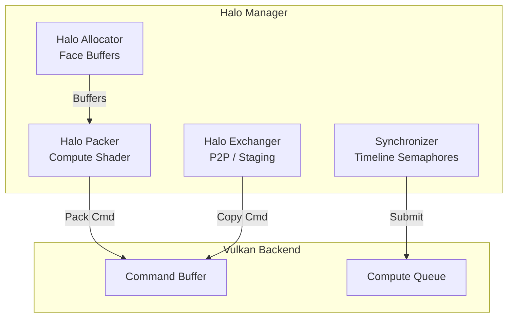

# Module 5: Halo System

## Overview
This module manages the "ghost regions" or halos required for stencil operations across GPU boundaries. It handles buffer allocation, data packing, and inter-GPU synchronization.

**Key Responsibilities:**
- **Halo Allocation**: Buffers for each face of each sub-domain
- **Data Packing**: Compute shaders extract boundary voxels
- **Exchange Mechanisms**: Peer-to-peer (P2P) or staging via host
- **Synchronization**: Timeline semaphores for proper ordering

**Vulkan C++ API Usage:**
All command recording, barriers, and synchronization use vulkan.hpp types (`vk::CommandBuffer`, `vk::MemoryBarrier`, `vk::Semaphore`).

## C4 Architecture

### Component Diagram


## Detailed Implementation Plan

### Phase 1: Halo Buffer Allocation
**Goal**: Allocate buffers to store boundary data.

1.  **Class `HaloManager` Implementation**:
    -   **File**: `src/halo/HaloManager.hpp` / `.cpp`
    -   **Step 1.1**: `allocateHalos(field, domain, thickness)`
        -   Calculate dimensions of the sub-domain bounding box: `dim = domain.bounds.dim()`.
        -   **Face 0 (-X)**: Size `thickness * dim.y * dim.z * field.elementSize`.
        -   **Face 1 (+X)**: Size `thickness * dim.y * dim.z * field.elementSize`.
        -   **Face 2 (-Y)**: Size `dim.x * thickness * dim.z * field.elementSize`.
        -   ... and so on for 6 faces.
        -   Allocate `LocalHalo`: `VK_BUFFER_USAGE_STORAGE_BUFFER_BIT | VK_BUFFER_USAGE_TRANSFER_DST_BIT`.
        -   Allocate `RemoteHalo`: `VK_BUFFER_USAGE_STORAGE_BUFFER_BIT | VK_BUFFER_USAGE_TRANSFER_SRC_BIT`.
        -   Store in `HaloBufferSet`.

### Phase 2: Halo Packing Shader
**Goal**: Extract non-contiguous boundary voxels into a contiguous buffer.

1.  **Shader**: `shaders/halo_pack.comp`
    -   **Step 2.1**: Layout & Push Constants
        ```glsl
        layout(local_size_x = 64) in;
        layout(push_constant) uniform PC {
            uint64_t gridAddr;
            uint64_t fieldAddr;
            uint64_t haloAddr;
            ivec3 domainMin;
            ivec3 domainMax;
            uint face; // 0..5
            uint thickness;
        };
        ```
    -   **Step 2.2**: Coordinate Mapping
        -   `idx = gl_GlobalInvocationID.x`.
        -   Example for Face -X:
            -   `x = idx % thickness`
            -   `y = (idx / thickness) % dim_y`
            -   `z = (idx / (thickness * dim_y))`
            -   `worldCoord = domainMin + ivec3(x, y, z)`
    -   **Step 2.3**: Read/Write
        -   `voxelIdx = NanoVDB_Read(gridAddr, worldCoord)`
        -   `val = (voxelIdx != -1) ? Field(fieldAddr).data[voxelIdx] : 0`
        -   `Halo(haloAddr).data[idx] = val`

### Phase 3: Exchange & Sync
**Goal**: Move data between GPUs.

1.  **Logic**:
    -   **Step 3.1**: `recordExchange(cmd, myHalos, neighborHalos)`
    -   **Step 3.2**: Barrier (Compute -> Transfer) using C++ API
        ```cpp
        vk::MemoryBarrier barrier{
            .srcAccessMask = vk::AccessFlagBits::eShaderWrite,
            .dstAccessMask = vk::AccessFlagBits::eTransferRead
        };
        cmd.pipelineBarrier(
            vk::PipelineStageFlagBits::eComputeShader,
            vk::PipelineStageFlagBits::eTransfer,
            vk::DependencyFlags{}, barrier, nullptr, nullptr);
        ```
    -   **Step 3.3**: Copy using C++ API
        ```cpp
        vk::BufferCopy region{
            .srcOffset = 0,
            .dstOffset = 0,
            .size = size
        };
        cmd.copyBuffer(myHalos.remote[face], neighborHalos.local[oppositeFace], region);
        ```
        -   **Note**: For multi-GPU, `neighborHalos.local` must be mapped or P2P enabled. If not P2P, copy `Remote -> Staging (Host) -> Local`.
    -   **Step 3.4**: Barrier (Transfer -> Compute) using C++ API
        ```cpp
        vk::MemoryBarrier barrier{
            .srcAccessMask = vk::AccessFlagBits::eTransferWrite,
            .dstAccessMask = vk::AccessFlagBits::eShaderRead
        };
        cmd.pipelineBarrier(
            vk::PipelineStageFlagBits::eTransfer,
            vk::PipelineStageFlagBits::eComputeShader,
            vk::DependencyFlags{}, barrier, nullptr, nullptr);
        ```

## Exposed Interfaces

### Struct: `HaloBufferSet`
```cpp
struct HaloBufferSet {
    std::array<MemoryAllocator::Buffer, 6> localHalos;
    std::array<MemoryAllocator::Buffer, 6> remoteHalos;
};
```

### Class: `HaloManager`
```cpp
class HaloManager {
public:
    HaloManager(VulkanContext& ctx, MemoryAllocator& allocator);
    ~HaloManager();

    // Allocate halo buffers for a field and domain
    HaloBufferSet allocateHalos(const FieldDesc& field,
                               const SubDomain& domain,
                               uint32_t thickness = 2);

    // Record commands to pack field data into halo buffers (using C++ CommandBuffer)
    void recordPack(vk::CommandBuffer cmd,
                   const FieldDesc& field,
                   const HaloBufferSet& halos,
                   const SubDomain& domain);

    // Record commands to exchange halos between GPUs (using C++ CommandBuffer)
    void recordExchange(vk::CommandBuffer cmd,
                       const HaloBufferSet& src,
                       const HaloBufferSet& dst,
                       uint32_t face);

    // Check if peer-to-peer memory is available
    bool isPeerMemoryAvailable() const { return m_peerMemoryAvailable; }

private:
    VulkanContext& m_context;
    MemoryAllocator& m_allocator;

    // Halo pack/unpack compute pipelines
    vk::Pipeline m_packPipeline;
    vk::Pipeline m_unpackPipeline;
    vk::PipelineLayout m_pipelineLayout;

    // Check for P2P support
    bool m_peerMemoryAvailable = false;
    void checkPeerMemorySupport();
};
```
