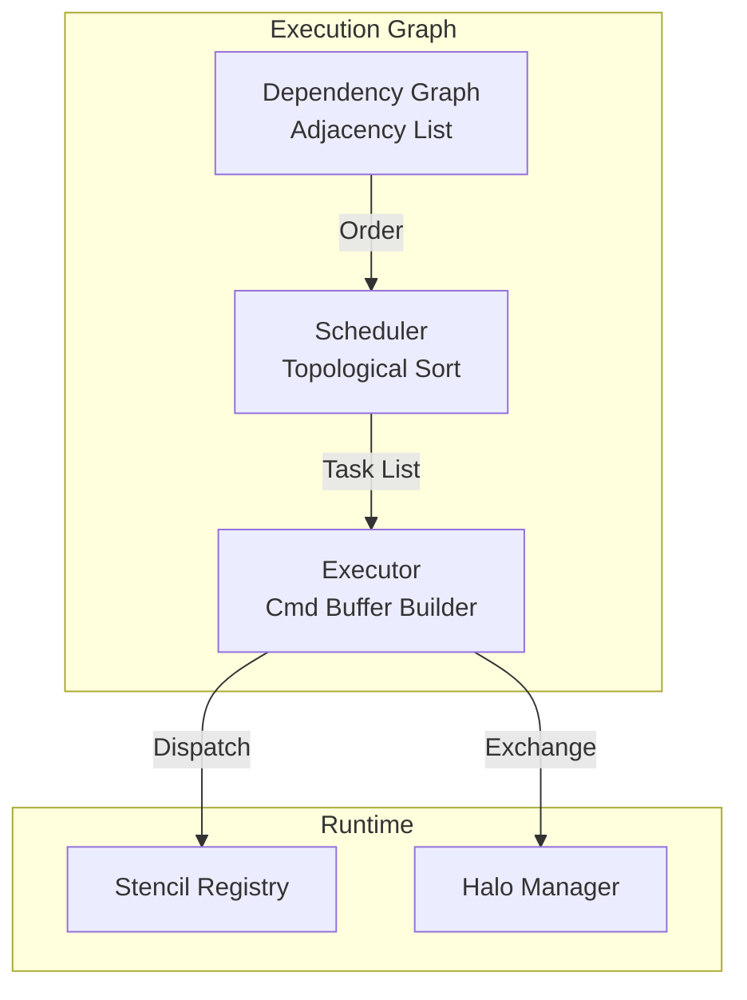

# Module 7: Execution Graph

## Overview
This module builds and executes the Directed Acyclic Graph (DAG) of stencil operations. It manages dependencies and schedules work across multiple GPUs.

## C4 Architecture

### Component Diagram


## Detailed Implementation Plan

### Phase 1: Dependency Graph
**Goal**: Determine execution order.

1.  **Class `DependencyGraph`**:
    -   **File**: `src/graph/DependencyGraph.hpp`
    -   **Step 1.1**: Data Structure
        -   `struct Node { string name; vector<string> reads; vector<string> writes; }`.
        -   `map<string, Node> nodes`.
    -   **Step 1.2**: `buildSchedule()` (Kahn's Algorithm)
        ```cpp
        // 1. Calculate in-degrees
        map<string, int> inDegree;
        for (auto& [name, node] : nodes) {
            for (auto& dep : node.reads) {
                 // Find who writes 'dep' -> edge writer->reader
            }
        }
        
        // 2. Queue zero-degree nodes
        queue<string> q;
        for (auto& [name, deg] : inDegree) if (deg == 0) q.push(name);
        
        // 3. Process
        vector<string> schedule;
        while (!q.empty()) {
            string u = q.front(); q.pop();
            schedule.push_back(u);
            for (auto& v : adj[u]) {
                if (--inDegree[v] == 0) q.push(v);
            }
        }
        
        // 4. Cycle Check
        if (schedule.size() != nodes.size()) throw std::runtime_error("Cycle detected!");
        ```

### Phase 2: Command Recording
**Goal**: Translate schedule to Vulkan commands.

1.  **Class `GraphExecutor`**:
    -   **File**: `src/graph/GraphExecutor.cpp`
    -   **Step 2.1**: `recordTimestep(cmd, schedule)`
    -   **Step 2.2**: Loop `node` in `schedule`:
        -   **Barrier** (Read-after-Write):
            ```cpp
            VkMemoryBarrier barrier = {
                .srcAccessMask = VK_ACCESS_SHADER_WRITE_BIT,
                .dstAccessMask = VK_ACCESS_SHADER_READ_BIT
            };
            vkCmdPipelineBarrier(cmd, VK_PIPELINE_STAGE_COMPUTE_SHADER_BIT, 
                               VK_PIPELINE_STAGE_COMPUTE_SHADER_BIT, 0, 1, &barrier, 0, nullptr, 0, nullptr);
            ```
        -   **Halo Exchange** (if needed):
            -   `haloMgr.recordPack(...)`.
            -   Barrier (Compute -> Transfer).
            -   `haloMgr.recordExchange(...)`.
            -   Barrier (Transfer -> Compute).
        -   **Dispatch**:
            -   `vkCmdBindPipeline`.
            -   `vkCmdPushConstants` (BDA table, grid info).
            -   `vkCmdDispatch((activeVoxels + 127)/128, 1, 1)`.

## Exposed Interfaces

### Class: `DependencyGraph`
```cpp
class DependencyGraph {
public:
    // Add a stencil node with its field dependencies
    void addNode(const std::string& name,
                const std::vector<std::string>& reads,
                const std::vector<std::string>& writes);

    // Build execution schedule (topological sort)
    // Throws if circular dependency detected
    std::vector<std::string> buildSchedule();

    // Export DOT format for visualization
    std::string exportDOT() const;

private:
    struct Node {
        std::string name;
        std::vector<std::string> reads;
        std::vector<std::string> writes;
        std::vector<std::string> dependencies; // Incoming edges
    };
    std::map<std::string, Node> m_nodes;
};
```

### Class: `GraphExecutor`
```cpp
class GraphExecutor {
public:
    GraphExecutor(VulkanContext& ctx, HaloManager& haloMgr, FieldRegistry& fields);

    // Record all stencils for a timestep (using C++ CommandBuffer)
    void recordTimestep(vk::CommandBuffer cmd,
                        const std::vector<std::string>& schedule,
                        const std::map<std::string, vk::Pipeline>& pipelines,
                        const std::map<std::string, vk::PipelineLayout>& layouts,
                        const SubDomain& domain);

private:
    VulkanContext& m_context;
    HaloManager& m_haloManager;
    FieldRegistry& m_fields;

    // Insert memory barriers between dependent stencils
    void recordBarrier(vk::CommandBuffer cmd);
};
```
