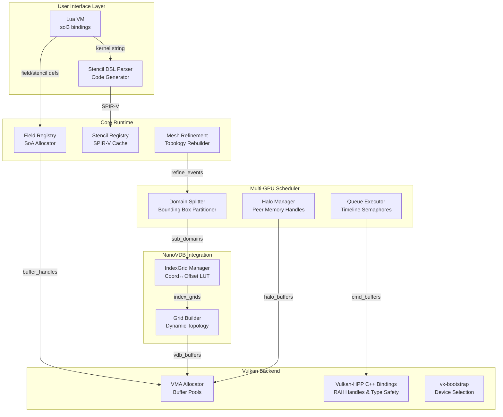

# Implementation Plan: Vulkan Fluid Engine with NanoVDB & SOA

## C4 Architecture Overview

### **C1: System Context**
```mermaid
graph TB
    subgraph "User Domain"
        USR[User Scripts<br/>Lua/Python API]
        DEV[Developer<br/>C++ Plugin]
    end
    
    subgraph "Fluid Engine System"
        CORE[Core Runtime]
        VDB[ NanoVDB Grid Manager ]
        GPU[ Vulkan Compute Backend ]
    end
    
    subgraph "Hardware"
        GPU1[GPU 0]
        GPU2[GPU 1]
        GPU3[...]
    end
    
    USR -->|add_field(), add_stencil()| CORE
    DEV -->|register_kernel()| CORE
    CORE -->|decompose_domain()| VDB
    VDB -->|sub_grid_handles| GPU
    GPU -->|dispatch| GPU1
    GPU -->|dispatch & halo_exchange| GPU2
    GPU -->|dispatch & halo_exchange| GPU3
```

---

### **C2: Container Diagram**


---

### **C3: Component Diagram (Core Runtime)**
```mermaid
graph TB
    subgraph "FieldSystem"
        FReg[FieldRegistry<br/>map<string, FieldDesc>]
        BPool[BufferPool<br/>vmaCreatePool()]
        BDA[BufferDeviceAddress Table<br/>uint64_t field_addrs[256]]
    end
    
    subgraph "StencilSystem"
        SReg[StencilRegistry<br/>map<string, ComputePipeline>]
        PCache[PipelineCache<br/>VkPipelineCache]
        JIT[JITCompiler<br/>dxc.dll wrapper]
    end
    
    subgraph "DomainSystem"
        DTree[DomainTree<br/>BoundingBox splits]
        HBuf[HaloBufferSet<br/>VkBuffer per_face × N_GPU]
        Sync[HaloSync<br/>VkSemaphore timeline]
    end
    
    subgraph "NanoVDB_Adapter"
        IGrid[IndexGridCache<br/>map<Box3i, GpuGridHandle>]
        OTable[OffsetTable<br/>vector<Coord> ↔ uint32_t]
    end
    
    FReg -->|field_count| BPool
    BPool -->|VkBuffer| BDA
    BDA -->|push_constant| SReg
    JIT -->|SPIR-V| PCache
    SReg -->|pipeline| DTree
    DTree -->|sub_box| IGrid
    IGrid -->|linear_index| OTable
    HBuf -->|peer_memory| Sync
```

---

## **Implementation Details**

**CRITICAL: This engine uses Vulkan C++ bindings (vulkan.hpp) exclusively for type safety and RAII resource management. All Vulkan objects use vk:: namespace.**

### **1. SoA Layout & Field Registration**

#### **Core Data Structure**
```cpp
// FieldRegistry.hpp
struct FieldDesc {
    std::string name;
    vk::Format format;              // vk::Format::eR32Sfloat, vk::Format::eR32G32B32Sfloat
    size_t elementSize;             // sizeof(float), sizeof(glm::vec3)
    void* defaultValue;             // For clearing: float{0.0f}
    vk::Buffer buffer;              // VMA allocation (wrapped in RAII)
    VmaAllocation allocation;       // VMA handle
    vk::DeviceAddress deviceAddress; // From device.getBufferAddress()
    uint32_t descriptorIndex;       // Index in BDA table
};

class FieldRegistry {
    // Map of all active fields
    robin_hood::unordered_map<std::string, FieldDesc> m_fields;
    
    // Single VkBuffer containing all field addresses (bindless)
    VkBuffer m_bdaTableBuffer;
    VmaAllocation m_bdaTableAllocation;
    uint64_t* m_bdaTableMapped; // Host-visible for updates
    
public:
    // Called by user: sim:add_field("density", "float32", 0.0)
    vk::DeviceAddress registerField(const std::string& name, vk::Format format, void* defaultValue) {
        // 1. Get total active voxel count from NanoVDB IndexGrid
        uint32_t voxelCount = m_indexGrid->activeVoxelCount();

        // 2. Allocate GPU buffer via VMA (using C++ buffer create info)
        vk::BufferCreateInfo bufferInfo{
            .size = voxelCount * elementSize,
            .usage = vk::BufferUsageFlagBits::eStorageBuffer |
                     vk::BufferUsageFlagBits::eShaderDeviceAddress
        };

        // VMA still uses C API, convert from C++ to C for VMA call
        VkBufferCreateInfo vkBufferInfo = bufferInfo;
        VmaAllocationCreateInfo allocInfo = {
            .usage = VMA_MEMORY_USAGE_GPU_ONLY,
            .pool = m_largeBufferPool // Pre-allocated pool for fast alloc
        };

        VkBuffer rawBuffer;
        vmaCreateBuffer(m_allocator, &vkBufferInfo, &allocInfo, &rawBuffer, &desc.allocation, nullptr);
        desc.buffer = vk::Buffer(rawBuffer); // Wrap in C++ type

        // 3. Get device address for bindless access (using C++ API)
        vk::BufferDeviceAddressInfo addressInfo{ .buffer = desc.buffer };
        desc.deviceAddress = m_device.getBufferAddress(addressInfo);

        // 4. Update BDA table (host-visible, flushed to GPU)
        m_bdaTableMapped[desc.descriptorIndex] = static_cast<uint64_t>(desc.deviceAddress);

        return desc.deviceAddress;
    }
};
```

#### **Shader-Side SoA Access**
```glsl
// User-visible header (generated per simulation)
#version 460
#extension GL_EXT_buffer_reference : require
#extension GL_EXT_buffer_reference_uvec2 : require

// Bindless field table passed via push constants
layout(push_constant) uniform FieldTable {
    uint64_t density;      // FieldRegistry::deviceAddress
    uint64_t velocity_x;
    uint64_t velocity_y;
    uint64_t velocity_z;
    uint64_t pressure;
    // ... up to 256 fields
} fields;

// Buffer reference types for each field
layout(buffer_reference, buffer_reference_align = 4) buffer DensityBuf { float data[]; };
layout(buffer_reference, buffer_reference_align = 4) buffer VelocityBuf { vec3 data[]; };

// User-facing macros (generated from FieldRegistry)
#define ReadDensity(idx) (DensityBuf(fields.density).data[(idx)])
#define WriteDensity(idx, val) (DensityBuf(fields.density).data[(idx)] = val)
#define ReadVelocity(idx) (VelocityBuf(fields.velocity_x).data[(idx)])
```

---

### **2. NanoVDB Domain Decomposition (Proper Style)**

#### **Domain Splitting Philosophy**
NanoVDB uses **leaf-node aligned partitioning** to avoid splitting 8³ leaf nodes across GPUs. The rule: **split boundaries must align to leaf node boundaries** (multiples of 8).

```cpp
// DomainSplitter.hpp
class DomainSplitter {
    // Input: Full NanoVDB grid bounding box
    const nanovdb::CoordBBox m_fullDomain;
    
    // Output: Per-GPU sub-domains (inclusive leaf node coordinates)
    std::vector<nanovdb::CoordBBox> m_subDomains;
    
    // Node count per GPU for load balancing
    std::vector<uint32_t> m_leafNodeCounts;
    
public:
    // Algorithm: Greedy leaf-node distribution
    void decomposeToGPUs(uint32_t gpuCount) {
        // 1. Collect all leaf nodes in the sparse grid
        std::vector<nanovdb::CoordBBox> leafBoxes;
        for (auto it = m_fullGrid->tree().beginLeaf(); it; ++it) {
            leafBoxes.push_back(it->getNodeBoundingBox());
        }
        
        // 2. Sort by Morton order for spatial locality
        std::sort(leafBoxes.begin(), leafBoxes.end(), 
            [](const auto& a, const auto& b) {
                return nanovdb::morton_code(a.min()) < nanovdb::morton_code(b.min());
            });
        
        // 3. Partition leaf nodes evenly (balancing active voxel count)
        uint64_t totalVoxels = m_fullGrid->activeVoxelCount();
        uint64_t perGpuVoxels = totalVoxels / gpuCount;
        
        uint64_t currentCount = 0;
        uint32_t currentGpu = 0;
        nanovdb::CoordBBox currentDomain;
        
        for (const auto& leafBox : leafBoxes) {
            currentDomain.expand(leafBox);
            currentCount += leafBox.volume();
            
            // When we exceed per-gpu budget (or last leaf), finalize domain
            if (currentCount >= perGpuVoxels || &leafBox == &leafBoxes.back()) {
                m_subDomains.push_back(currentDomain);
                m_leafNodeCounts.push_back(currentDomain.volume() / (8*8*8));
                
                // Reset for next GPU
                currentCount = 0;
                currentDomain = nanovdb::CoordBBox();
                currentGpu++;
            }
        }
    }
    
    // Get the IndexGrid for a specific GPU's sub-domain
    nanovdb::GridHandle<nanovdb::HostBuffer> extractSubGrid(uint32_t gpuIndex) {
        // Use NanoVDB's GridBuilder to crop to sub-domain
        nanovdb::GridBuilder<float> builder(0.0f);
        
        auto iter = m_fullGrid->tree().beginValueOn();
        for (; iter; ++iter) {
            const nanovdb::Coord& coord = iter.getCoord();
            if (m_subDomains[gpuIndex].isInside(coord)) {
                builder.setValue(coord, *iter);
            }
        }
        
        return builder.getHandle();
    }
};
```

#### **GPU-Side Sub-Grid Representation**
Each GPU holds:
- 1x **IndexGrid** for its sub-domain (topology only)
- 1x **VkBuffer** for **halos** (6 faces × thickness)
- N-1x **VkBuffer** for **peer halo data** from other GPUs

```glsl
// Per-GPU shader resource layout
layout(set = 0, binding = 0) buffer SubGrid { pnanovdb_buf_t grid; };
layout(set = 0, binding = 1) buffer HaloBuffers {
    // XY faces: [-x, +x, -y, +y, -z, +z]
    float halo_neg_x[]; // Stride: (haloThickness × yDim × zDim)
    float halo_pos_x[];
    float halo_neg_y[];
    // ... all faces
};
```

---

### **3. Halo Setup & Synchronization**

#### **Halo Buffer Structure**
Halo thickness = **2 voxels** (enough for 2nd-order stencils like Laplacian).

```cpp
// HaloManager.hpp (using Vulkan C++ bindings)
struct HaloBufferSet {
    // Each field gets its own HaloBufferSet
    // Dimensions: [face][depth][width][height]

    // Local halo storage (read from neighbors)
    std::array<vk::Buffer, 6> localHalos; // vk::BufferUsageFlagBits::eStorageBuffer

    // Remote halo storage (sent to neighbors)
    std::array<vk::Buffer, 6> remoteHalos; // vk::BufferUsageFlagBits::eTransferSrc

    // Peer memory handles for P2P (if supported)
    std::array<vk::DeviceMemory, 6> peerMemory; // For P2P transfers

    // Current sync state (timeline semaphore values)
    std::array<uint64_t, 6> writeValue; // Last completed halo write
    std::array<uint64_t, 6> readValue;  // Last consumed halo read
};

class HaloManager {
    // Creates halo buffers sized for worst-case leaf node boundary
    void allocateHaloBuffers(const FieldDesc& field, uint32_t gpuIndex) {
        const auto& domain = m_subDomains[gpuIndex];
        const uint32_t haloThickness = 2;
        
        // Size calculation per face
        // Face X: thickness × yDim × zDim
        VkDeviceSize faceSize = haloThickness * domain.dim().y() * domain.dim().z();
        
        for (int face = 0; face < 6; face++) {
            // Using C++ bindings for buffer creation
            vk::BufferCreateInfo bufferInfo{
                .size = faceSize * field.elementSize,
                .usage = vk::BufferUsageFlagBits::eStorageBuffer |
                         vk::BufferUsageFlagBits::eTransferSrc |
                         vk::BufferUsageFlagBits::eTransferDst,
                .sharingMode = vk::SharingMode::eExclusive
            };

            // VMA allocation with dedicated pool for frequent transfers
            VkBufferCreateInfo vkBufferInfo = bufferInfo;
            VkBuffer rawBuffer;
            vmaCreateBuffer(m_allocator, &vkBufferInfo, &m_haloAllocInfo,
                           &rawBuffer, &set.allocations[face], nullptr);
            set.localHalos[face] = vk::Buffer(rawBuffer);

            // For remote halos: allocate in host-visible memory for staging
            vk::BufferCreateInfo remoteInfo = bufferInfo;
            remoteInfo.usage = vk::BufferUsageFlagBits::eTransferSrc;
            m_haloAllocInfo.usage = VMA_MEMORY_USAGE_CPU_TO_GPU;

            VkBufferCreateInfo vkRemoteInfo = remoteInfo;
            VkBuffer rawRemoteBuffer;
            vmaCreateBuffer(m_allocator, &vkRemoteInfo, &m_haloAllocInfo,
                           &rawRemoteBuffer, &set.remoteAllocations[face], nullptr);
            set.remoteHalos[face] = vk::Buffer(rawRemoteBuffer);
        }
    }
    
    // Pack halo data from field buffer into remote halo buffer
    void packHalo(VkCommandBuffer cmd, const FieldDesc& field, uint32_t face) {
        // Compute shader: threads map to halo voxel coordinates
        // Input: field buffer (indexed by linear index)
        // Output: remoteHalos[face] (linear array)
        
        HaloPackPushConstants pc = {
            .fieldAddress = field.deviceAddress,
            .haloAddress = getHaloAddress(face),
            .face = face,
            .domainMin = m_subDomains[gpuIndex].min(),
            .haloThickness = 2
        };
        
        // Using C++ API for push constants and dispatch
        cmd.pushConstants(m_pipelineLayout, vk::ShaderStageFlagBits::eCompute,
                         0, sizeof(pc), &pc);
        cmd.dispatch(haloVoxelCount / 128 + 1, 1, 1);
    }
    
    // Exchange halos between GPUs
    void exchangeHalos(VkCommandBuffer cmd, uint32_t srcGpu, uint32_t dstGpu) {
        // Method 1: Peer Memory (if VK_KHR_device_group enabled)
        if (m_peerMemoryAvailable) {
            // No copy needed; dst GPU directly reads src GPU's remoteHalos[face]
            // Using C++ API for memory barrier
            vk::MemoryBarrier barrier{
                .srcAccessMask = vk::AccessFlagBits::eShaderWrite,
                .dstAccessMask = vk::AccessFlagBits::eShaderRead
            };
            cmd.pipelineBarrier(
                vk::PipelineStageFlagBits::eComputeShader,
                vk::PipelineStageFlagBits::eComputeShader,
                vk::DependencyFlags{}, barrier, nullptr, nullptr);
        } else {
            // Method 2: Staging through host
            // cmd.copyBuffer(src.remoteHalos → host staging → dst.localHalos)
            // Use timeline semaphore to coordinate

            vk::BufferCopy copyRegion{
                .srcOffset = 0,
                .dstOffset = 0,
                .size = faceSize
            };
            // Note: This requires proper queue ownership transfer
            // Implementation details depend on multi-device setup

            vk::TimelineSemaphoreSubmitInfo timelineInfo{
                .signalSemaphoreValueCount = 1,
                .pSignalSemaphoreValues = &m_writeValue[face]
            };

            vk::PipelineStageFlags waitStage = vk::PipelineStageFlagBits::eComputeShader;
            vk::SubmitInfo submitInfo{
                .pNext = &timelineInfo,
                .waitSemaphoreCount = 1,
                .pWaitSemaphores = &m_haloReadSemaphores[srcGpu],
                .pWaitDstStageMask = &waitStage,
                .commandBufferCount = 1,
                .pCommandBuffers = &cmd,
                .signalSemaphoreCount = 1,
                .pSignalSemaphores = &m_haloWriteSemaphores[dstGpu]
            };

            // Using C++ queue submit
            m_computeQueue.submit(submitInfo);
        }
    }
};
```

#### **Halo Shader Implementation**
```glsl
// halo_pack.comp
layout(push_constant) uniform PC {
    uint64_t fieldAddress;
    uint64_t haloAddress;
    uint32_t face; // 0=-x, 1=+x, 2=-y, 3=+y, 4=-z, 5=+z
    ivec3 domainMin;
    uint32_t haloThickness;
} pc;

void main() {
    uint haloIdx = gl_GlobalInvocationID.x;
    
    // Map halo linear index to 3D coordinate in world space
    ivec3 haloCoord = mapHaloIndexToCoord(haloIdx, pc.face, pc.domainMin, pc.haloThickness);
    
    // Query VDB to get linear index of this halo voxel
    uint linearIdx = pnanovdb_read_uint(pc.grid, haloCoord);
    
    // Read from field buffer (if voxel exists)
    float value = (linearIdx != ~0u) ? DensityBuf(pc.fieldAddress).data[linearIdx] : 0.0;
    
    // Write to halo buffer (always dense)
    HaloBuf(pc.haloAddress).data[haloIdx] = value;
}

// Helper: maps halo array index to world coordinate
ivec3 mapHaloIndexToCoord(uint idx, uint face, ivec3 domainMin, uint thickness) {
    // Implementation depends on face orientation
    // For face=-x: coordinate = domainMin + ivec3(-thickness + x, y, z)
    // where x = idx % thickness, y/z = idx / thickness
}
```

---

### **4. User API: Zero-Engine-Modification Workflow**

#### **Runtime Scripting Integration**
```lua
-- User script: setup.fluid
local sim = FluidEngine.new({
    device_count = 2,
    domain_bbox = {min={-128,-128,-128}, max={128,128,128}},
    halo_thickness = 2
})

-- 1. Define fields (no engine recompile)
sim:add_field("density", "float32", 0.0)
sim:add_field("velocity", "vec3", {0,0,0})
sim:add_field("pressure", "float32", 0.0)
sim:add_field("temperature", "float32", 300.0)

-- 2. Define stencils (Domain-Specific Language)
sim:add_stencil("advect_density", {
    inputs = {"density", "velocity"},
    outputs = {"density_new"},
    code = [[
        vec3 pos = CoordToWorld(coord);
        vec3 vel = ReadField("velocity", coord);
        vec3 back_pos = pos - dt * vel;
        ivec3 back_coord = WorldToCoord(back_pos);
        
        float d = ReadField("density", back_coord);
        WriteField("density_new", idx, d);
    ]],
    requires_neighbors = true,
    neighbor_radius = 1  -- For trilinear interpolation
})

sim:add_stencil("compute_divergence", {
    inputs = {"velocity_x", "velocity_y", "velocity_z"},
    outputs = {"divergence"},
    code = [[
        float dx = ReadField("velocity_x", coord + ivec3(1,0,0)) - 
                   ReadField("velocity_x", coord + ivec3(-1,0,0));
        float dy = ReadField("velocity_y", coord + ivec3(0,1,0)) - 
                   ReadField("velocity_y", coord + ivec3(0,-1,0));
        float dz = ReadField("velocity_z", coord + ivec3(0,0,1)) - 
                   ReadField("velocity_z", coord + ivec3(0,0,-1));
        
        WriteField("divergence", idx, (dx + dy + dz) * 0.5);
    ]],
    requires_halos = true  -- Automatically triggers halo exchange
})

-- 3. Build simulation DAG
sim:add_dependency("divergence", "pressure_solve")  -- Pressure depends on divergence
sim:add_dependency("pressure", "project_velocity")  -- Projection depends on pressure

-- 4. Run
sim:initialize()
sim:run_timestep(dt=0.016)
```

#### **Engine-Side DSL Processing**
```cpp
// StencilDSLCompiler.hpp
class StencilDSLCompiler {
    // Parses user stencil definition and generates complete shader
    std::string generateComputeShader(const StencilDef& stencil) {
        std::stringstream shader;
        
        // 1. Header & extensions
        shader << R"(
            #version 460
            #extension GL_EXT_buffer_reference : require
            #include "PNanoVDB.h"
            #include "field_macros.glsl"  // Generated by FieldRegistry
        )";
        
        // 2. Push constants (field table + stencil parameters)
        shader << "layout(push_constant) uniform StencilPC {\n";
        shader << "    FieldTable fields;\n";  // From FieldRegistry::getBDATable()
        for (const auto& param : stencil.pushConstants) {
            shader << "    " << param.type << " " << param.name << ";\n";
        }
        shader << "} pc;\n";
        
        // 3. Main dispatch loop
        shader << R"(
            void main() {
                uint linear_idx = gl_GlobalInvocationID.x;
                if (linear_idx >= pc.active_voxel_count) return;
                
                // Map to world coordinate (inverse lookup)
                ivec3 coord = pc.coord_lut[linear_idx];
        )";
        
        // 4. User code injection (sanitized & validated)
        shader << "        // --- User Stencil Code Begin ---\n";
        shader << sanitizeUserCode(stencil.code);
        shader << "        // --- User Stencil Code End ---\n";
        
        // 5. Footer
        shader << "    }\n";
        
        return shader.str();
    }
    
    // Compiles HLSL/GLSL to SPIR-V using DXC at runtime
    std::vector<uint32_t> compileToSPIRV(const std::string& source, const std::string& entryPoint) {
        // Initialize DXC compiler (once)
        static CComPtr<IDxcCompiler3> compiler = initializeDXC();
        
        // Prepare source buffer
        DxcBuffer sourceBuffer = {
            .Ptr = source.c_str(),
            .Size = source.size(),
            .Encoding = DXC_CP_UTF8
        };
        
        // Compile arguments
        std::vector<LPCWSTR> args = {
            L"-E", L"main",
            L"-T", L"cs_6_6",
            L"-spirv",
            L"-fspv-target-env=vulkan1.3",
            L"-fvk-use-dx-layout"  // For buffer references
        };
        
        IDxcResult* result = nullptr;
        compiler->Compile(&sourceBuffer, args.data(), args.size(), nullptr, IID_PPV_ARGS(&result));
        
        // Extract SPIR-V bytecode
        IDxcBlob* bytecode = nullptr;
        result->GetResult(&bytecode);
        
        return std::vector<uint32_t>(
            static_cast<uint32_t*>(bytecode->GetBufferPointer()),
            static_cast<uint32_t*>(bytecode->GetBufferPointer()) + bytecode->GetBufferSize() / 4
        );
    }
};
```

#### **Field Macro Generation**
```cpp
// FieldMacros.hpp (generated per simulation state)
class FieldMacroGenerator {
    void regenerate(const FieldRegistry& registry) {
        std::ofstream file("generated/field_macros.glsl");
        
        // 1. Buffer reference declarations
        for (const auto& [name, desc] : registry) {
            file << "layout(buffer_reference, align=" << desc.elementSize << ") ";
            file << "buffer Field_" << name << "_Buf { ";
            file << glslType(desc.format) << " data[]; };\n";
        }
        
        // 2. ReadField/WriteField macros
        file << "\n// --- Auto-generated field accessors ---\n";
        for (const auto& [name, desc] : registry) {
            file << "#define ReadField_" << name << "(idx) ";
            file << "(Field_" << name << "_Buf(fields." << name << ").data[(idx)])\n";
            
            file << "#define WriteField_" << name << "(idx, val) ";
            file << "(Field_" << name << "_Buf(fields." << name << ").data[(idx)] = (val))\n";
        }
        
        // 3. Generic coordinate-based lookup (for neighbors)
        file << R"(
            // Generic field read with VDB neighbor lookup
            #define ReadField(name, coord) \
                ({ uint _idx = pnanovdb_read_uint(pc.grid, coord); \
                   _idx != ~0u ? ReadField_##name(_idx) : 0.0; })
        )";
    }
};
```

---

### **5. Multi-GPU Execution Graph**

#### **Command Buffer Generation (Per Timestep)**
```cpp
// SimulationExecutor.hpp
class SimulationExecutor {
    void executeTimestep(float dt) {
        std::vector<VkCommandBuffer> cmds(m_gpuCount);
        
        for (uint32_t gpu = 0; gpu < m_gpuCount; gpu++) {
            // Using C++ API for command buffer
            vk::CommandBufferBeginInfo beginInfo{};
            cmds[gpu].begin(beginInfo);
            
            // 1. Pack halos from previous timestep
            for (const auto& stencil : m_stencils) {
                if (stencil.requires_halos) {
                    for (int face = 0; face < 6; face++) {
                        m_haloManager.packHalo(cmds[gpu], field, face);
                    }
                }
            }
            
            // 2. Submit pack commands (all GPUs)
            cmds[gpu].end();
        }

        // 3. Global halo exchange (cross-GPU sync)
        m_haloManager.exchangeHalos(cmds);

        // 4. Execute stencils (per-GPU, parallel)
        for (uint32_t gpu = 0; gpu < m_gpuCount; gpu++) {
            vk::CommandBufferBeginInfo beginInfo{};
            cmds[gpu].begin(beginInfo);
            
            // Update push constants (timestep, field addresses)
            StencilPushConstants pc = {
                .fields = m_fieldRegistry.getBDATable(),
                .dt = dt,
                .active_voxel_count = m_subGrids[gpu].activeVoxelCount,
                .grid = m_subGrids[gpu].deviceAddress,
                .coord_lut = m_subGrids[gpu].coordLUTAddress
            };
            
            // Bind stencil pipeline (C++ API)
            cmds[gpu].bindPipeline(vk::PipelineBindPoint::eCompute, m_stencilPipeline);
            cmds[gpu].pushConstants(m_pipelineLayout, vk::ShaderStageFlagBits::eCompute,
                                   0, sizeof(pc), &pc);

            // Dispatch: one thread per active voxel
            uint32_t groupCount = (m_subGrids[gpu].activeVoxelCount + 127) / 128;
            cmds[gpu].dispatch(groupCount, 1, 1);

            // Pipeline barrier before next stencil (C++ API)
            vk::MemoryBarrier barrier{
                .srcAccessMask = vk::AccessFlagBits::eShaderWrite,
                .dstAccessMask = vk::AccessFlagBits::eShaderRead
            };
            cmds[gpu].pipelineBarrier(
                vk::PipelineStageFlagBits::eComputeShader,
                vk::PipelineStageFlagBits::eComputeShader,
                vk::DependencyFlags{}, barrier, nullptr, nullptr);

            cmds[gpu].end();
        }
        
        // 5. Submit all command buffers with timeline semaphores (C++ API)
        std::vector<vk::TimelineSemaphoreSubmitInfo> timelineInfos(m_gpuCount);
        std::vector<vk::SubmitInfo> submitInfos(m_gpuCount);

        for (uint32_t gpu = 0; gpu < m_gpuCount; gpu++) {
            timelineInfos[gpu] = vk::TimelineSemaphoreSubmitInfo{
                .signalSemaphoreValueCount = 1,
                .pSignalSemaphoreValues = &m_timelineValues[gpu]
            };

            vk::PipelineStageFlags waitStage = vk::PipelineStageFlagBits::eComputeShader;
            submitInfos[gpu] = vk::SubmitInfo{
                .pNext = &timelineInfos[gpu],
                .waitSemaphoreCount = (gpu == 0) ? 0u : 1u,
                .pWaitSemaphores = (gpu == 0) ? nullptr : &m_haloSemaphores[gpu-1],
                .pWaitDstStageMask = (gpu == 0) ? nullptr : &waitStage,
                .commandBufferCount = 1,
                .pCommandBuffers = &cmds[gpu],
                .signalSemaphoreCount = 1,
                .pSignalSemaphores = &m_timelineSemaphores[gpu]
            };

            // Using C++ queue submit
            m_computeQueues[gpu].submit(submitInfos[gpu]);
        }
    }
};
```

---

### **6. Dynamic Mesh Refinement**

#### **Refinement Trigger System**
```cpp
// RefinementManager.hpp
class RefinementManager {
    // User-defined refinement criterion
    std::function<bool(ivec3 coord, float value)> m_refinementCriterion;
    
    // Runs on GPU: marks voxels for refinement
    void markRefinementCells(VkCommandBuffer cmd) {
        // Dispatch over all active voxels
        vkCmdBindPipeline(cmd, VK_PIPELINE_BIND_POINT_COMPUTE, m_markPipeline);
        
        MarkPushConstants pc = {
            .grid = m_indexGrid.deviceAddress,
            .densityField = m_fieldRegistry["density"].deviceAddress,
            .vorticityThreshold = 0.5f,
            .outputMask = m_refinementMaskBuffer
        };
        
        vkCmdPushConstants(cmd, m_markLayout, VK_SHADER_STAGE_COMPUTE_BIT, 0, sizeof(pc), &pc);
        vkCmdDispatch(cmd, m_activeVoxelCount / 128 + 1, 1, 1);
    }
    
    // Runs on CPU: rebuilds topology and remaps fields
    void rebuildTopology() {
        // 1. Download refinement mask (sparse: voxel ID → action)
        std::vector<uint8_t> mask = downloadMask();
        
        // 2. Build new grid topology
        nanovdb::GridBuilder<float> builder(0.0f);
        uint32_t newLinearIndex = 0;
        
        for (auto iter = m_oldGrid->tree().beginValueOn(); iter; ++iter) {
            ivec3 coord = iter.getCoord();
            uint32_t oldIdx = m_offsetTable[coord];
            
            // Check mask: 0=keep, 1=refine (split into 8 children), 2=coarsen
            if (mask[oldIdx] == 1) {
                // Refine: add 8 child voxels at half spacing
                for (int i = 0; i < 8; i++) {
                    ivec3 childCoord = getChildCoord(coord, i);
                    builder.setValue(childCoord, *iter); // Same value, finer grid
                    m_newOffsetTable[childCoord] = newLinearIndex++;
                }
            } else if (mask[oldIdx] == 0) {
                // Keep: transfer with same index
                builder.setValue(coord, *iter);
                m_newOffsetTable[coord] = newLinearIndex++;
            }
            // Coarsen: skip (merge into parent)
        }
        
        // 3. Create new IndexGrid
        m_newIndexGrid = nanovdb::createIndexGrid(builder.getHandle());
        
        // 4. Remap field data (GPU → GPU copy via compute shader)
        VkCommandBuffer cmd = beginOneTimeCommands();
        vkCmdBindPipeline(cmd, VK_PIPELINE_BIND_POINT_COMPUTE, m_remapPipeline);
        
        RemapPushConstants pc = {
            .oldField = m_oldFieldBuffer,
            .newField = m_newFieldBuffer,
            .remapTable = m_remapTableBuffer, // oldIdx → newIdx mapping
            .oldCount = m_oldActiveVoxelCount,
        };
        
        vkCmdPushConstants(cmd, m_remapLayout, VK_SHADER_STAGE_COMPUTE_BIT, 0, sizeof(pc), &pc);
        vkCmdDispatch(cmd, m_oldActiveVoxelCount / 128 + 1, 1, 1);
        endOneTimeCommands(cmd);
        
        // 5. Update domain decomposition if load is imbalanced
        if (loadImbalanceDetected()) {
            m_domainSplitter.rebalance(m_newIndexGrid);
        }
    }
};
```

---

## **Summary: Implementation Flow**

1. **Startup**: vk-bootstrap → volk → Vulkan-HPP → VMA → Load NanoVDB grid → Build IndexGrid → Register fields → Allocate SoA buffers
2. **User Input**: Parse Lua/Python → Generate field macros → Compile stencils (DXC) → Build execution DAG
3. **Per Timestep**:
   - Pack halos (compute shaders)
   - Exchange halos (timeline semaphores + peer memory)
   - Execute stencils (ordered by DAG)
   - Check refinement triggers
   - Optionally rebuild topology & rebalance domains
4. **Visualization**: Optional graphics pass (via same Vulkan instance) reads field buffers directly for volume rendering

This architecture provides **complete separation** between engine internals and user code. Users can add fields/stencils at runtime via scripts, while the engine handles all Vulkan complexity through vk-bootstrap, VMA, and carefully designed managers.