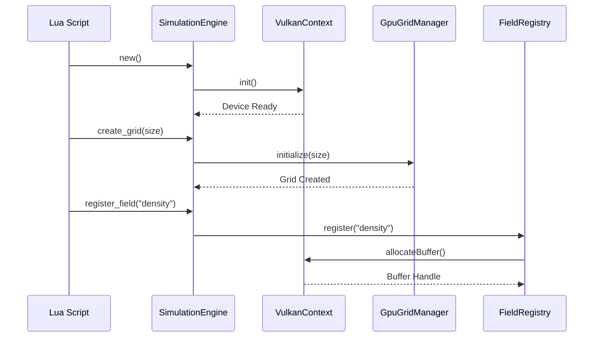
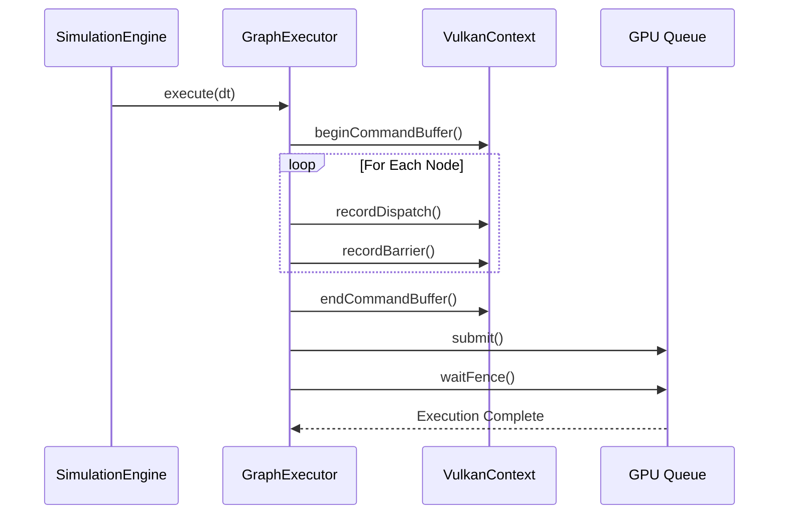

# Component Diagrams

Detailed interactions between major components.

## Initialization Sequence

```mermaid
sequenceDiagram
    participant Lua as Lua Script
    participant Engine as SimulationEngine
    participant VK as VulkanContext
    participant Grid as GpuGridManager
    participant Field as FieldRegistry
    
    Lua->>Engine: new()
    Engine->>VK: init()
    VK-->>Engine: Device Ready
    
    Lua->>Engine: create_grid(size)
    Engine->>Grid: initialize(size)
    Grid-->>Engine: Grid Created
    
    Lua->>Engine: register_field("density")
    Engine->>Field: register("density")
    Field->>VK: allocateBuffer()
    VK-->>Field: Buffer Handle
```

## Simulation Step Sequence

```mermaid
sequenceDiagram
    participant Engine as SimulationEngine
    participant Graph as GraphExecutor
    participant VK as VulkanContext
    participant GPU as GPU Queue
    
    Engine->>Graph: execute(dt)
    Graph->>VK: beginCommandBuffer()
    
    loop For Each Node
        Graph->>VK: recordDispatch()
        Graph->>VK: recordBarrier()
    end
    
    Graph->>VK: endCommandBuffer()
    Graph->>GPU: submit()
    Graph->>GPU: waitFence()
    GPU-->>Graph: Execution Complete
```
