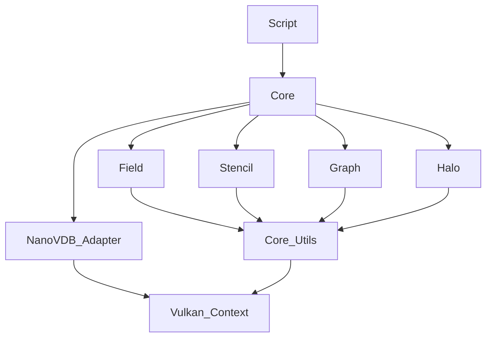

# System Architecture

FluidLoom follows a layered architecture pattern.

## Layers

### 1. Scripting Layer (Lua)
- **Responsibility**: Configuration, high-level control flow, stencil definition.
- **Components**: `LuaContext`, `SimulationEngine` bindings.
- **Interaction**: Calls into the C++ engine via `sol2` bindings.

### 2. Core Engine Layer (C++)
- **Responsibility**: Resource management, orchestration, graph execution.
- **Components**: `SimulationEngine`, `GraphExecutor`, `FieldRegistry`, `StencilRegistry`.
- **Interaction**: Manages the lifecycle of the simulation and coordinates the lower layers.

### 3. Service Layer
- **Responsibility**: Specific functionality like grid management, halo exchange, and logging.
- **Components**: `GpuGridManager`, `HaloManager`, `Logger`, `VulkanContext`.

### 4. Hardware Abstraction Layer (Vulkan/HAL)
- **Responsibility**: Interfacing with the GPU.
- **Components**: `vulkan.hpp`, `vk-bootstrap`, `volk`.
- **Interaction**: Submits command buffers to the GPU queues.

## Module Dependencies

