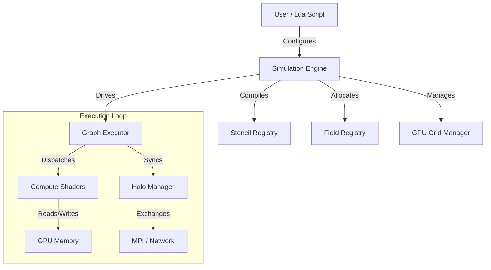

# Architecture

This section provides a high-level view of the FluidLoom system architecture, including its components, data structures, and technology stack.

## System Overview

FluidLoom is designed as a modular, data-driven simulation engine. It separates the simulation logic (defined in Lua/GLSL) from the execution engine (C++/Vulkan).

## Contents

- **[System Architecture](System_Architecture.md)**: Detailed breakdown of the system layers.
- **[Component Diagrams](Component_Diagrams.md)**: Interaction diagrams for key components.
- **[Data Structures](Database_Schema.md)**: Layout of data in memory (VDB, Fields).
- **[Infrastructure](Infrastructure.md)**: Deployment and hardware requirements.
- **[Tech Stack](Tech_Stack.md)**: Libraries and tools used.
