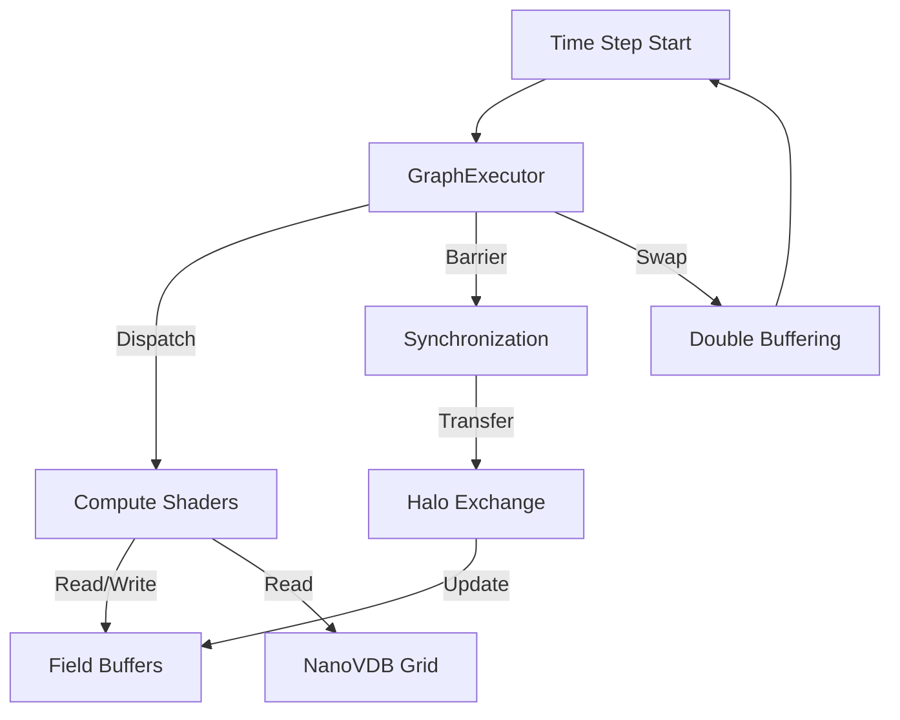

# Data Flow

Understanding how data moves through FluidLoom is critical for debugging and performance optimization.

## Initialization Flow

```mermaid
graph TD
    A[Lua Script] -->|Config| B[SimulationEngine]
    B -->|Init| C[VulkanContext]
    B -->|Create| D[GpuGridManager]
    B -->|Register| E[FieldRegistry]
    B -->|Compile| F[StencilRegistry]
    D -->|Upload| G[GPU Memory (VDB)]
    E -->|Allocate| H[GPU Memory (Fields)]
```

1. **Configuration**: The Lua script defines the domain, fields, and stencils.
2. **Resource Allocation**: The engine allocates GPU memory for the VDB grid and field buffers.
3. **Pipeline Creation**: Stencil shaders are compiled into Vulkan compute pipelines.

## Simulation Loop Flow



1. **Compute Dispatch**: The `GraphExecutor` records dispatch commands for each active stencil.
2. **Field Update**: Compute shaders read from the `current` field buffer and write to the `next` buffer.
3. **Halo Exchange**: After local computation, boundary data is exchanged with neighbors.
4. **Synchronization**: Memory barriers ensure that writes are visible before the next read.
5. **Swap**: Field buffers are swapped for the next time step.

## GPU-CPU Data Transfer

FluidLoom is designed to minimize CPU-GPU data transfer.

- **Initialization**: Grid topology is uploaded once (unless dynamic refinement occurs).
- **Simulation**: Data stays on the GPU.
- **Output**: Data is downloaded only when an I/O frame is requested (e.g., writing VDB files).
